## **Welcome to Linguistics**
 
.pull-left[
**Linguistics** the scientific study of language   

**overall course goal** - learn about basic concepts in <u>Linguistics</u>  
  
What **languages** do you speak (natively)?

]
.pull-right[
   

]

---
## **Welcome to Linguistics**
 
.pull-left[
**language** is something that comes naturally to us as human beings:
- We acquire our native language(s) as children simply by interacting with peers and caregivers  
- We use language to socialize, communicate, interact – nearly everything we do!  
- And we often use language without being consciously aware of it  

**language** is also extremely complicated:
- *Cambridge Grammar of the English Language* takes **1,860** pages to describe English
sentence structure – and it's still not complete!
]
.pull-right[
   

]

---
## **Course Goals**
  
Linguistics tries to make sense of this complicated system, and findings from linguistics have given us a lot of insight into how language works – but there's still more to learn   
So in this course, we're going to learn about how to analyze language from a linguistic point of view. We'll first learn some basics about language and linguistics. Then we'll spend 1-2 weeks on:  
- **Morphology** – the study of word structure
- **Syntax** – the study of sentence structure
  
- **Semantics** – the study of how (literal) meaning is derived from words and phrases
- **Pragmatics** – the study of how (implied) meaning is derived from language in context
  
- **Phonetics** – the study of the physical properties of speech sounds (or signs)
- **Phonology** – the study of speech sounds (or signs) as a system

---
## **What can you do with Linguistics?**
 
.pull-left[
- with a Linguistics education, you can work in:   
  - academics and education  
  - tech industry  
  - speech pathology  
  - second language education  
  - dialect coaching  
  - forensics  
  - language policy
]
.pull-right[
 
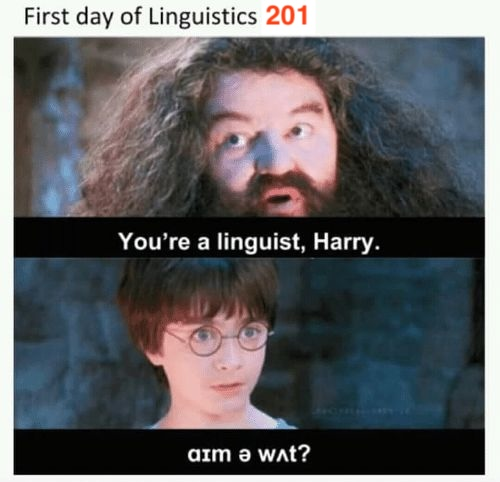
]

---
## **About the Course**
 
.pull-left[]
.pull-right[
<b>Mons/Thurs</b> <u>10:20 – 11:40 am</u> at [HH-B6](https://webapps.rutgers.edu/dcs/classrooms/HH-B6)  
All course materials will be made available via <b>Canvas</b> and [<b><i>github</i> site</b>](https://merlinudinov.github.io/spring2026ling201)
  - Readings need to be done before the class on Monday   

<b>Office/Student supporting hours</b>: Wednesday 10:00 – 11:00 am (subject to change) or by appointment
  - 003, Linguistics Building (18 Seminary Pl)  
  
You can always email me if you have any questions or concerns: 
  - [merlin.udinov@rutgers.edu](mailto:merlin.udinov@rutgers.edu)
  - I will respond within <b>48 hours</b> during weekdays
]
---

## **About the Course**
 
.pull-left[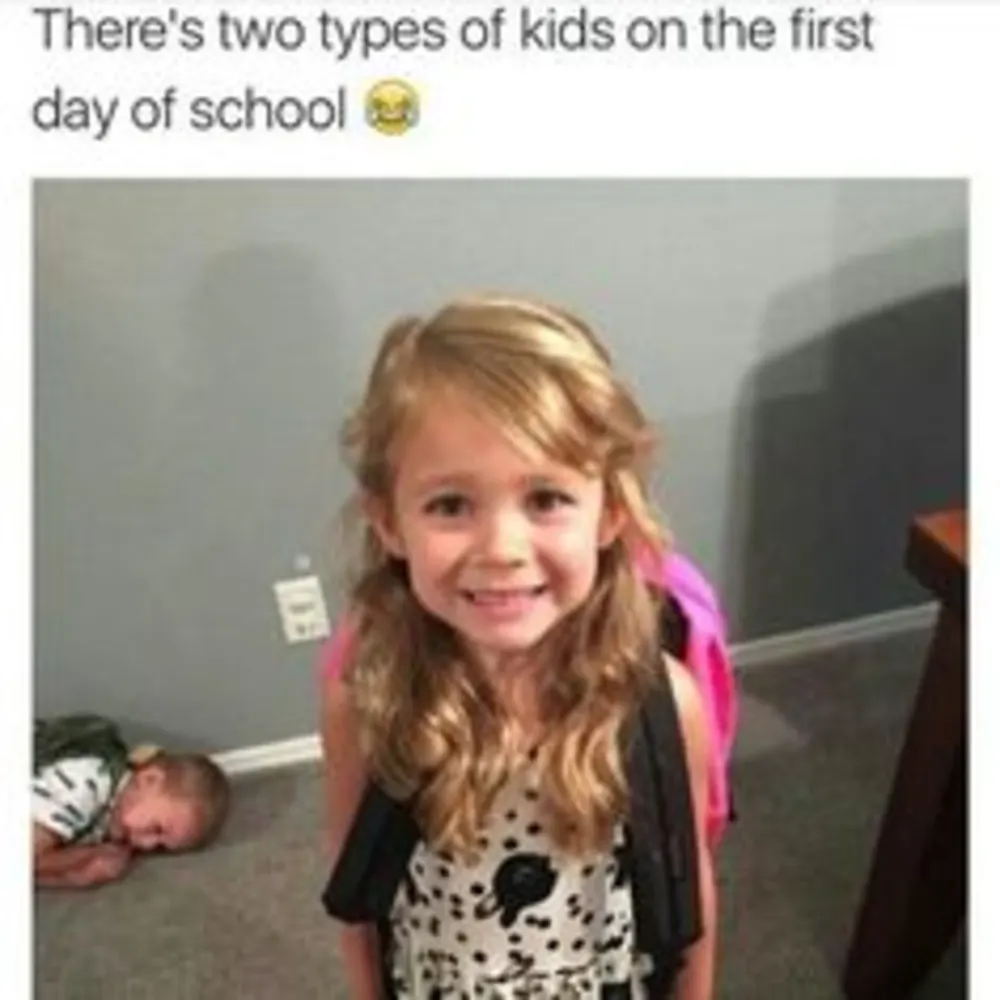]
.pull-right[
- A word of <b>caution</b>
  - There are some technical materials to master here
  - Some elements of the course will take time and practice to get the hang of  
- A word of <b>encouragement</b>
  - If you do the readings, show up to class, and practice, you will do fine!
  - Language is really a fascinating subject
]

---
## **Grade Components**
 
.pull-left[
- <b>Homework</b> (50%)  
  - **8** assignments total  
  - lowest **2** scores will be dropped  
  - will be posted on Canvas **one week before** they are due (check syllabus for dates)
  - The uploading file should be a **SINGLE** <b>.pdf</b> format   
  - **due on Sundays** at 11:59 pm one week from when it is posted on Canvas   
]
.pull-right[
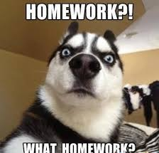

   

]

---
## **Grade Components**
 
.pull-left[
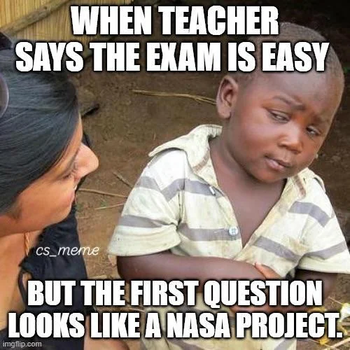
]
.pull-right[
- <b>Midterm and Final Exam</b> (20% each)  
  - problem sets, short-answer, multiple choice, etc.  
  - the midterm exam is on **MARCH 05**, at class time   
  - the final is **NOT** cumulative   
  - time and venue for the final will be announced later in the semester  
- <b>Extra Credit</b> (2%)  
  - specifics can be found on the syllabus
]

---
## **Grade Components**
 
.pull-left[
- <b>Attendance/Participation</b> (10%)  
  - if you show up in class and pick up your name card, you will be marked ‘present’ for that class  
  - if you cannot make it to class for any reason, please be sure to either let me know via a quick email or self-report your absence on the **system**  
  - all reported absences will be excused; you are **NOT** required to show me doctor’s notes as proof  
  - specifics can be found on the syllabus
]
.pull-right[
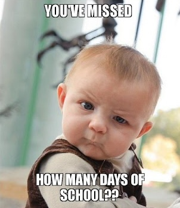
]

---
## **Resources for Students**
 
- **Linguistics Tutoring** – Rutgers Learning Centers (https://learningcenters.rutgers.edu/)
  - Offers walk-in tutoring; most semesters there is a Linguistics tutor on staff.  
- **Office of Disability Services** (https://ods.rutgers.edu/)
  - If you have a disability (visible or invisible, physical or mental) consider registering with ODS.
  - They can send a Letter of Accommodation to your professors.  
- **Dean of Students—Advocacy, Outreach and Support** (https://studentsupport.rutgers.edu/)
  - If you have a temporary condition, unexpected challenge, or need to take an extended absence, they can help support you and send a letter to your professors.  

  
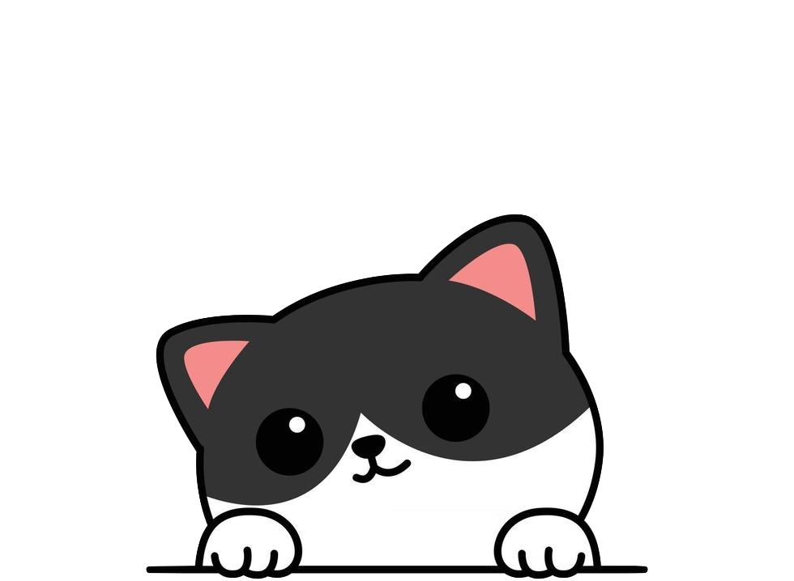

---
## **Course-related Reminders**
 
.pull-left[
**AI policy**: **NOT** allowed to use
- be aware of **AI's errors and hallucinations**  
- Hi, Prof. G. Please solve $x$ for $2x+1=0$.
- Sure thing! We can think it this way. **2** halves become a complete **1**, so $2x=1$...  
  
**homework dropping**
- lowest **two** Homework grades will be dropped
- use it **wisely**  

**being absent or late coming/early leaving**
- absence needs previous notifying via **email**  

**my own language issue**
]
.pull-right[

]
---
class: center, middle
# **Any Questions?**

---
class: center, middle

# **Mental Grammar**

## The unspoken rules of language

---

## **What is language? What is grammar?**
  
.pull-left[
.pull-left[]
.pull-right[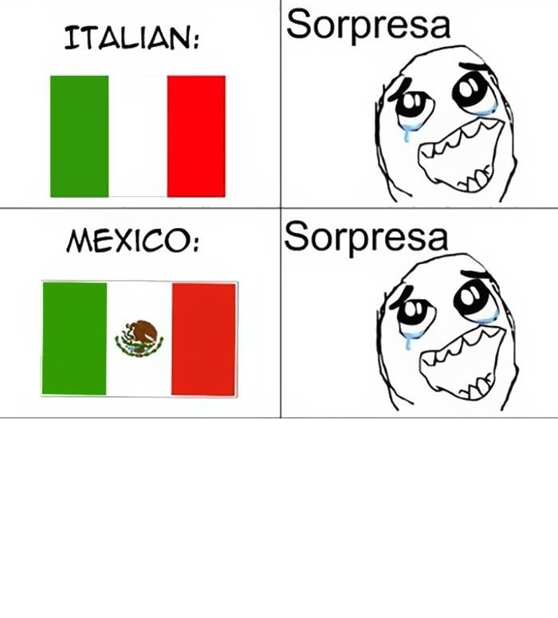]
  
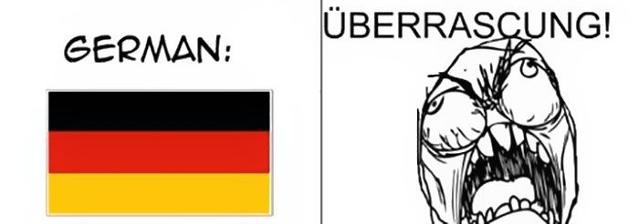]
.pull-right[
**discuss with your neighbors**  
- What is language?  
- What is grammar?  
- How are the two connected?
]

---
## **What is language?**
 
.pull-left[
- language is a *human communication system* we use for **communicating** ideas and **socializing**  
- language is a *systematic, rule-governed* **system**
  - language combines <b>sounds</b> (or signs) into <b>words</b>, and <b>words</b> into <b>sentences</b> to express complex ideas  
  - We need rules to understand how to put together ideas into language when speaking and decode language into ideas when listening: **a mental grammar**
]
.pull-right[
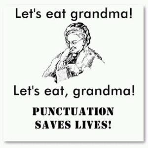
]

---
## **What is language?**
 
.pull-left[
- the rules of your mental grammar might not be those rules you learn in school or read in a textbook  
- but **every speaker has a mental grammar**, even if they're not aware of it, and no matter what language or dialect they speak.  
- *I ain't got no time*.  

  - **good**, we understand, accept and use it
  - **bad**, double negation is not allowed
]
.pull-right[
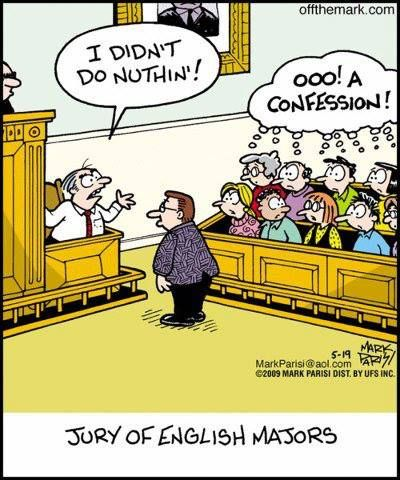
]

---

## **Linguistics:** the scientific study of language
 
.pull-left[
  
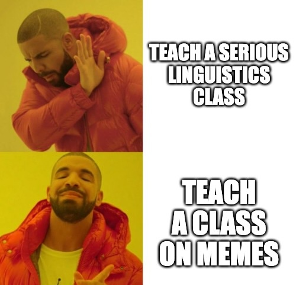
]
.pull-right[
- **scientific** method with experiments and **real-life data** to develop theories about how language works  

- primary goal: to figure out people’s <b>mental grammar</b>  

- For linguists, **grammar** includes:
  - how <u>sounds</u> are organized into <u>words</u>
  - how <u>words</u> are organized into <u>sentence</u>
  - how <u>sentences</u> are organized into <u>conversations</u>  

- We all use the rules of our native language grammar mostly without thinking about it, but it turns out that the grammar of any language is **extremely complex**
]

---
## **Unconscious Rules (The Wug Test)**
  
.pull-left[
- here's a grammatical rule you probably follow **without knowing** it exists:
  
- how do you form <b>plural nouns</b> in English?
  
- the linguist Jean Berko Gleason invented the famous **Wug Test** to study how children acquire grammatical rules
]
.pull-right[
  
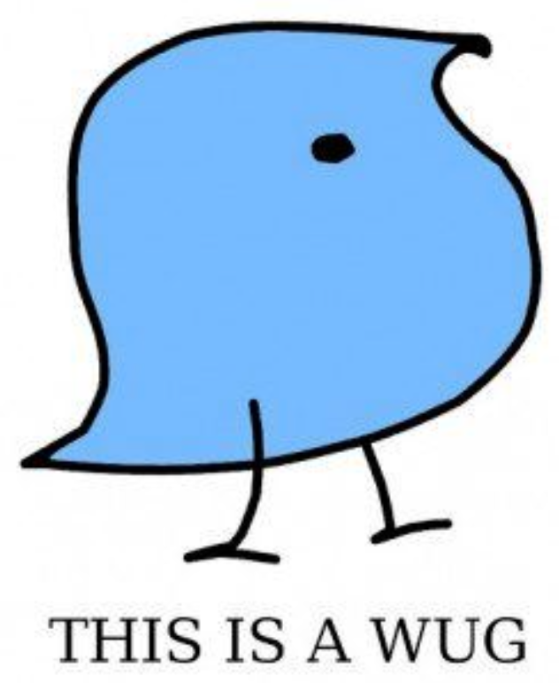
....

  
<i>Dr. Jean Berko Gleason...</i>
<i>Dr. Jean Berko Gleason</i>
]

---
## **Wug Test - wug**
 
.pull-left[
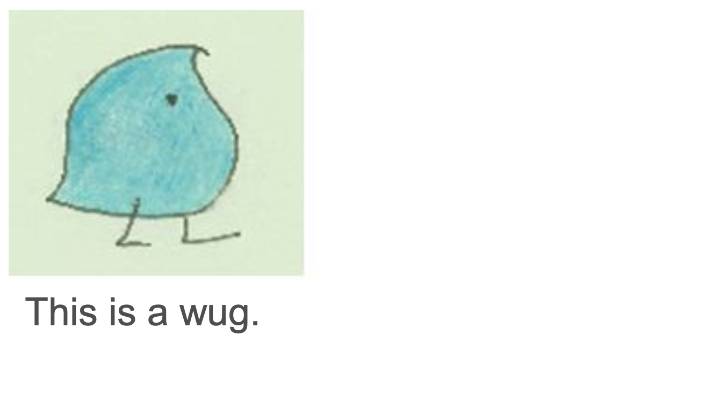
]
.pull-right[
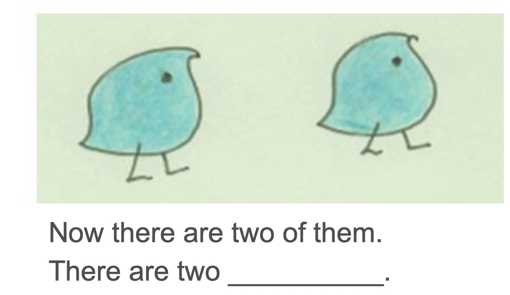
]
  
Fill in the blank. Focus on **sounds**, not the <b>spelling</b>  

1. wug[əz]

2. wug[z]

3. wug[s]

---
## **Wug Test - pesh**
 
.pull-left[
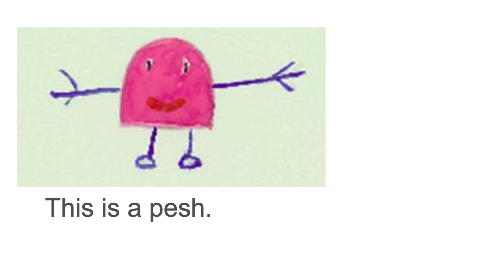
]
.pull-right[
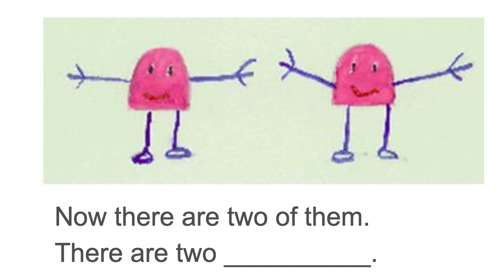
]
  
Fill in the blank. Focus on **sounds**, not the <b>spelling</b>  

1. pesh[əz]

2. pesh[z]

3. pesh[s]

---
## **Wug Test - lup**
 
.pull-left[
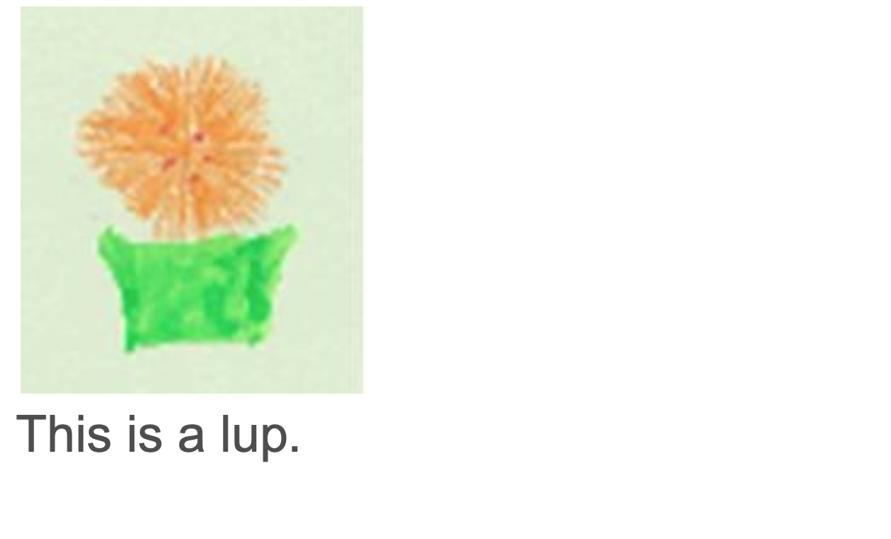
]
.pull-right[
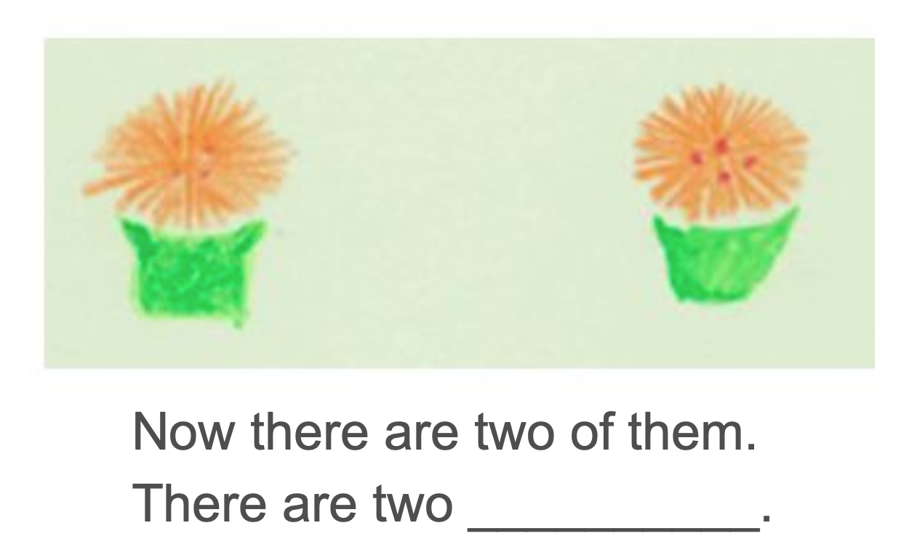
]
  
Fill in the blank. Focus on **sounds**, not the <b>spelling</b>  

1. lup[əz]

2. lup[z]

3. lup[s]

---
## **Wug Test - gutch**
 
.pull-left[

]
.pull-right[
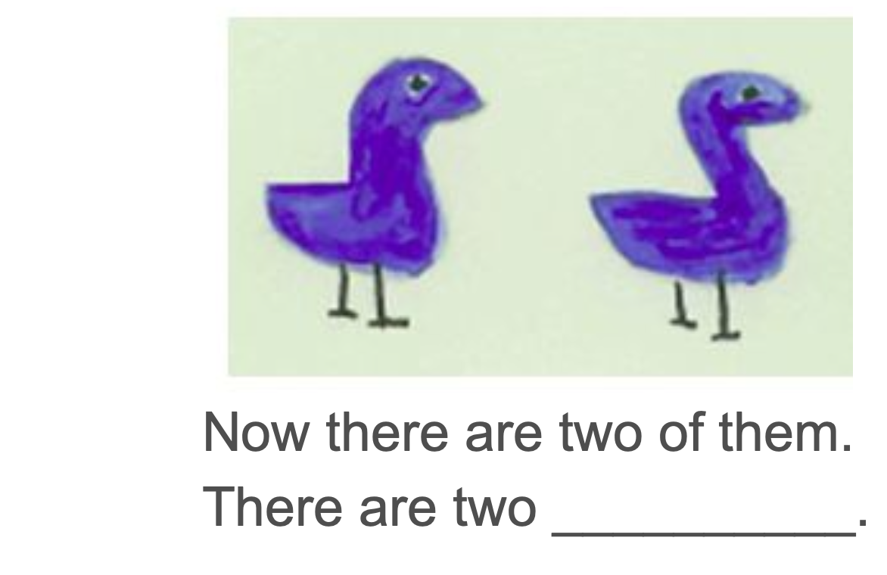
]
  
Fill in the blank. Focus on **sounds**, not the <b>spelling</b>  

1. gutch[əz]

2. gutch[z]

3. gutch[s]

---
## **Wug Test - peff**
 
.pull-left[
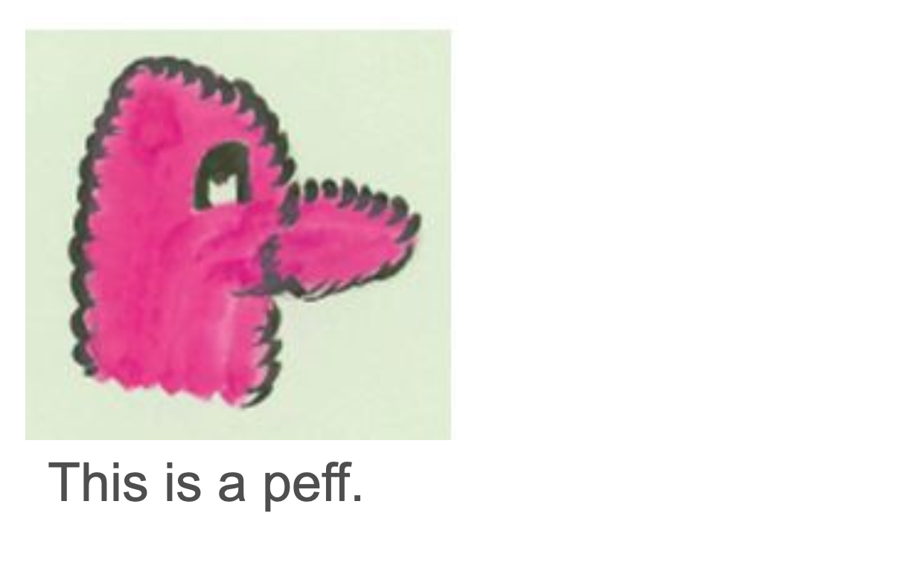
]
.pull-right[
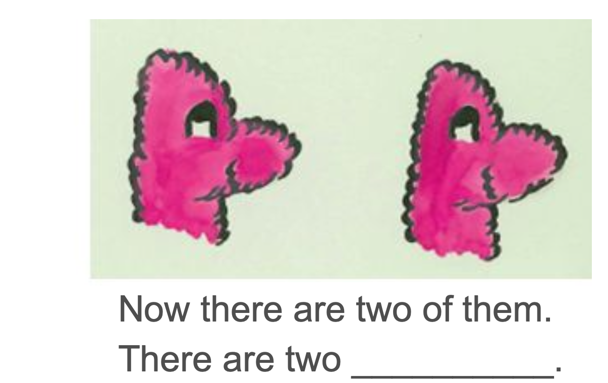
]
  
Fill in the blank. Focus on **sounds**, not the <b>spelling</b>  

1. peff[əz]

2. peff[z]

3. peff[s]

---
## **Wug Test - tor**
 
.pull-left[
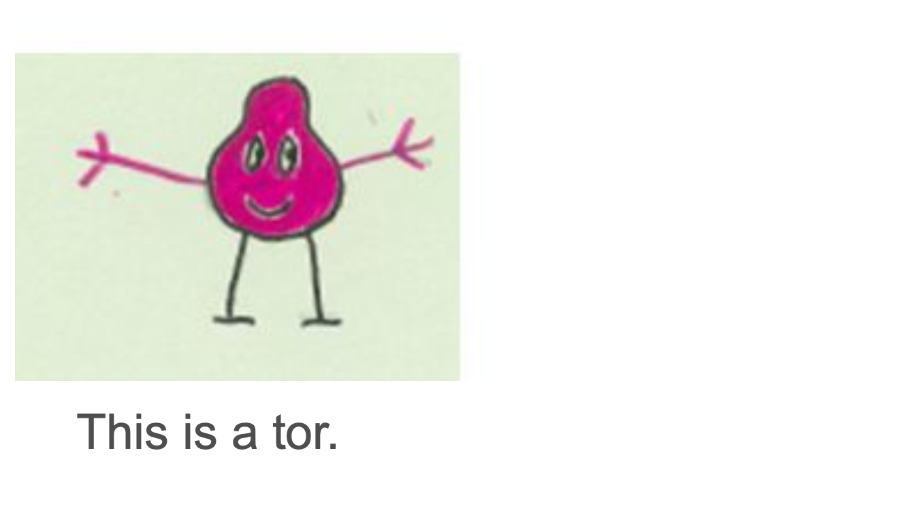
]
.pull-right[
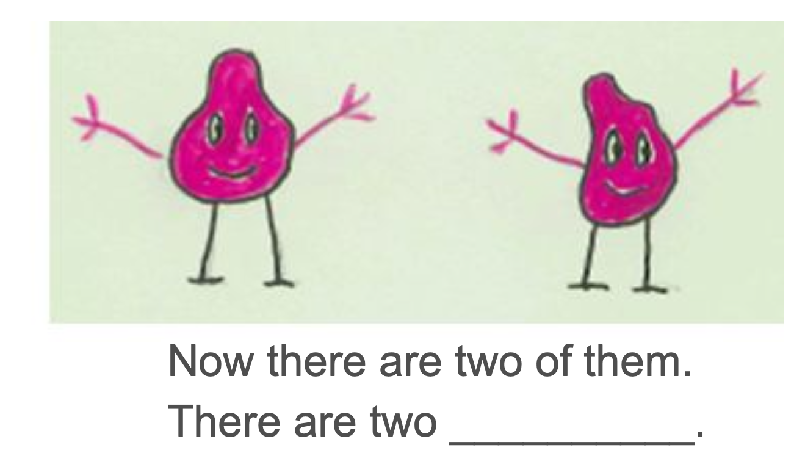
]
  
Fill in the blank. Focus on **sounds**, not the <b>spelling</b>  

1. tor[əz]

2. tor[z]

3. tor[s]

---
.pull-left[
## **English Plural Rules**
 
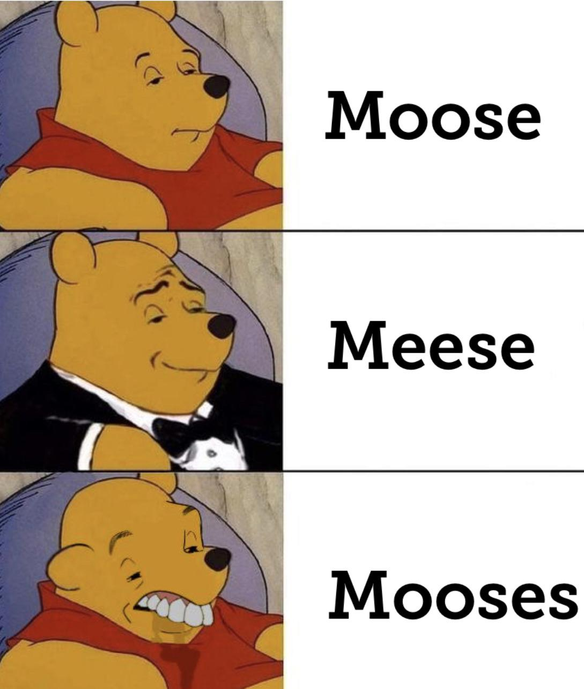]
.pull-right[  
English plurals follow **a simple rule** that we all figured out when
we learned the language  

but we probably **were never taught** it explicitly and most people aren't aware of it as adults 

- We know it's a rule because we were all <b>able to apply</b> that rule to new words  

1. Does the word end in a sibilant consonant? *(s, z, sh, zh, ch, j)*
  - **add [-əz]**  
2. Does the word end in a voiceless consonant? *(p, t, k, f, etc.)*
  - **add [-s]**  
3. Does the word end in a voiced consonant? *(b, d, g, m, n, l, r, etc.)* 
  - **add [-z]**
]

---
## **What do we know when we know a language?**
  
.pull-left[
Which of these words **could be** English words?  
1. threal  
2. sthklings  
3. winthrangs  
4. sthampfs  
5. pkalikfs  
6. kroshield
]
.pull-right[
  
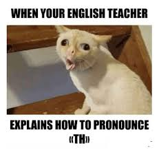
]

---
## **What do we know when we know a language?**
  
.pull-left[
Which of these words **could be** English words?  
1. **threal**  
2. sthklings  
3. **winthrangs**  
4. sthampfs  
5. pkalikfs  
6. **kroshield**
]
.pull-right[
  

]
---
## **What do we know when we know a language?**
  
.pull-left[
 
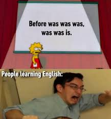]
.pull-right[
Which of these sentences are **possible** in English?  
1. The linguist met a philosopher in Athens.  
2. Linguist the met philosopher Athens in.  
3. The linguist thinks that she is in Paris.  
4. The linguist thinks she is in Paris.  
5. The linguist wonders whether she is intelligent.  
6. The linguist wonders she is intelligent.
]

---
## **What do we know when we know a language?**
  
.pull-left[
 
]
.pull-right[
Which of these sentences are **possible** in English?  
1. **The linguist met a philosopher in Athens**.  
2. Linguist the met philosopher Athens in.  
3. **The linguist thinks that she is in Paris**.  
4. **The linguist thinks she is in Paris**.  
5. **The linguist wonders whether she is intelligent**.  
6. The linguist wonders she is intelligent.
]

---
## **What do we know when we know a language?**
  
In which context is this sentence **true**?  

<b><i>Every giraffe talked to a panda.</i></b>
  
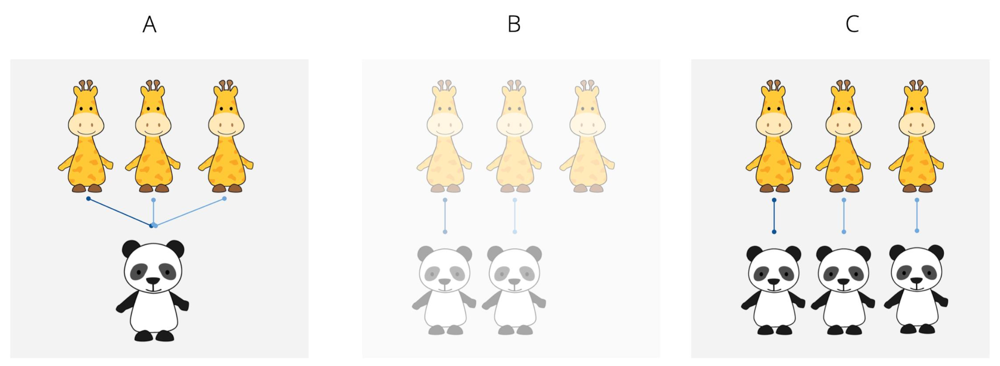

---
## **What do we know when we know a language?**
 
we reached a **consensus** in the simple tests we did  

but how did you know this?  
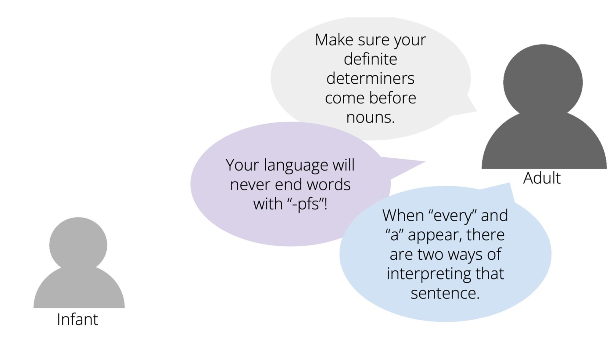

---
## **What do we know when we know a language?**
 
.pull-left[
A native speaker of **language L** knows a lot about this **language L**:  
- possible/impossible <b>sounds</b> and <b>sound combinations</b> of L  
- possible/impossible <b>sentence</b> of L  
- possible/impossible <b>meaning</b> of novel sentences   
- but this knowledge is **unconscious**
]
.pull-right[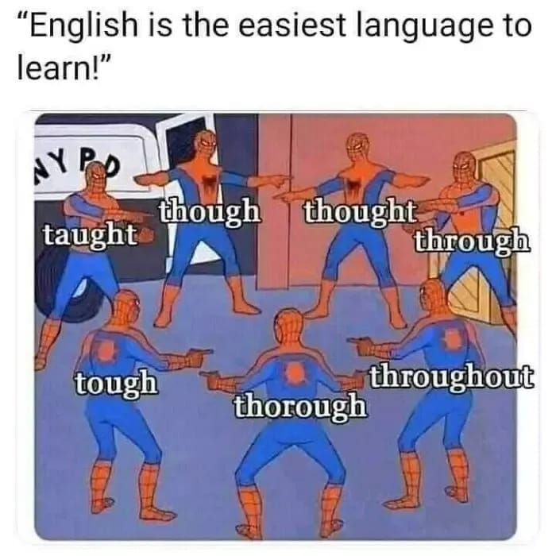]

---
## **Linguistic Rules**
 
- One goal of **Linguistics** is to *figure out the rules that explain how language works*  

- All varieties of all languages follow systematic rules, and all speakers have these rules as part of their **mental grammar**, aka their **linguistic competence**
  - grammatical rules may be **unconscious**: we largely use them without being aware of it
  - even **non-standard varieties** have grammatical rules
  - **every speaker** of **every language and variety** has a mental grammar  
  
- throughout the semester, we'll keep coming back to this idea of a **mental grammar**, we'll learn ways to figure out how grammar works at every level:
  - sounds
  - words
  - sentences
  - conversations  

- when we say grammar, **we're talking about what people** ***really do***, and not necessarily what they're "supposed" to do according to textbooks or English class

---
## Linguistics as A **Science**
 
.pull-left[
- Linguistics is the **scientific** study of langauge   
- But what does it mean to say that it's **science**?    
- What is a science?  

]
.pull-right[
Science uses the **scientific method** to test hypotheses about how natural phenomena (in our case, language) work:
1. Develop a **hypothesis** grounded in personal observations, theory, and previous research  
2. **Design an experiment** to collect real-world (empirical) data to test your hypothesis  
3. Run your experiment, **collect** your data  
4. **Analyse your data** - is your hypothesis true or false?  
5. Based on your results, update your theories, develop a new hypothesis, and **repeat**!
]
---
## Linguistics as A **Science**
 
.pull-left[
1. I found everyone around me is a linguist (**observation**)  
2. I thought that every Rutgers student is a linguist (**hypothesis**)  
3. I went out and asked every one (**experiment**)  
4. I found a Rutgers student who is actually mathematician (**reject**)  
5. I have a new hypothesis! (**repeat**)
]

.pull-right[
Come up with your own experiment!
- Most English permits only 1 modal/clause: I <u>*might*</u> eat. I <u>*could*</u> eat.  
- Southern American English permits 2: I <u>*might*</u> <u>*could*</u> eat.
Come up with a hypothesis – a statement that could be true or false – about English modals. (Ideas: Where specifically? What about other modals: can, may, should, oughta? Does anyone use more than 2?)   
- What kind of data could you collect to prove or disprove your hypothesis? How could you design an experiment to collect that data?
]

---
class: center, middle
**no homework** is due this week  
<b>readings</b> <i>Thinking like a Linguist</i> [Anderson Ch1]   

  
Slides created via the R package [**xaringan**](https://github.com/yihui/xaringan).

