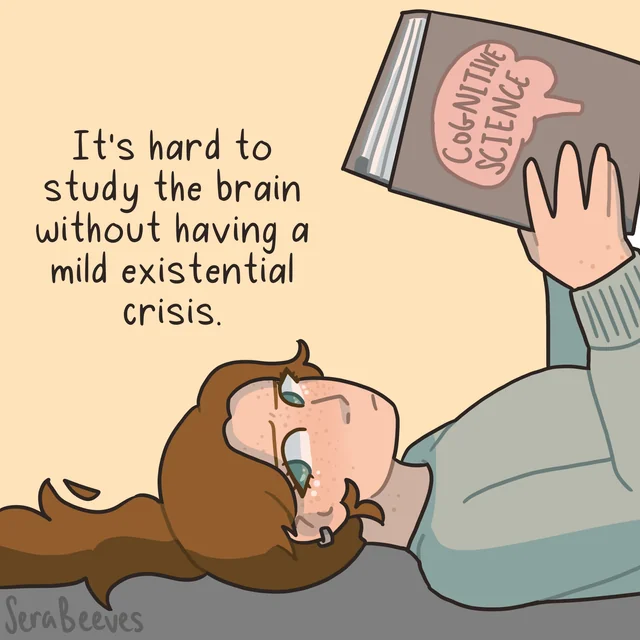
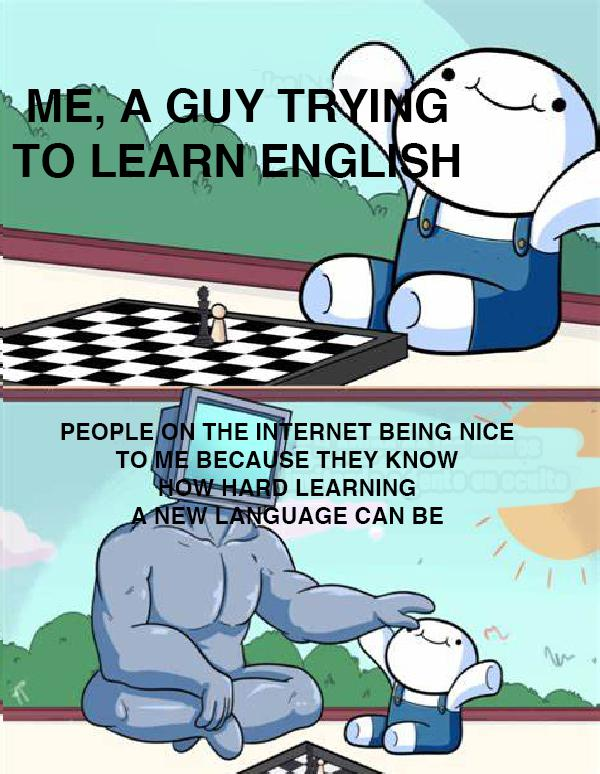
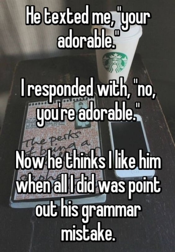
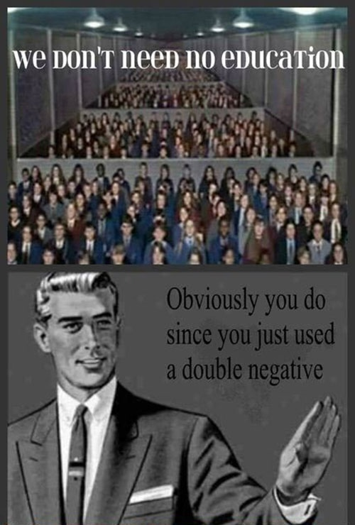
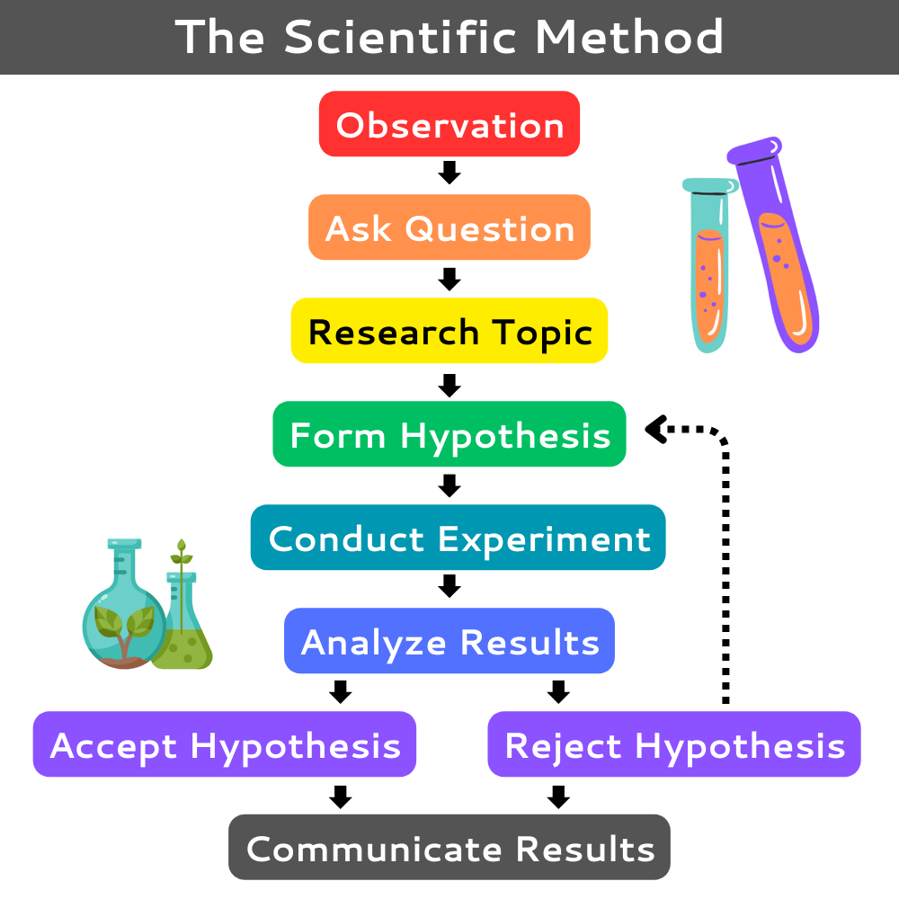
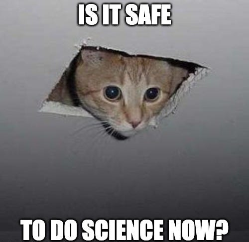
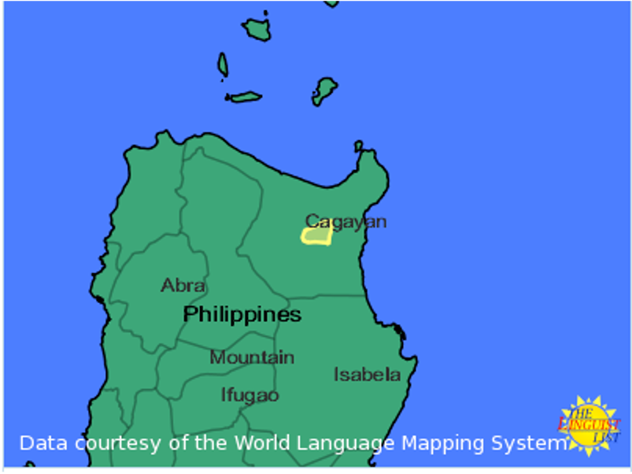
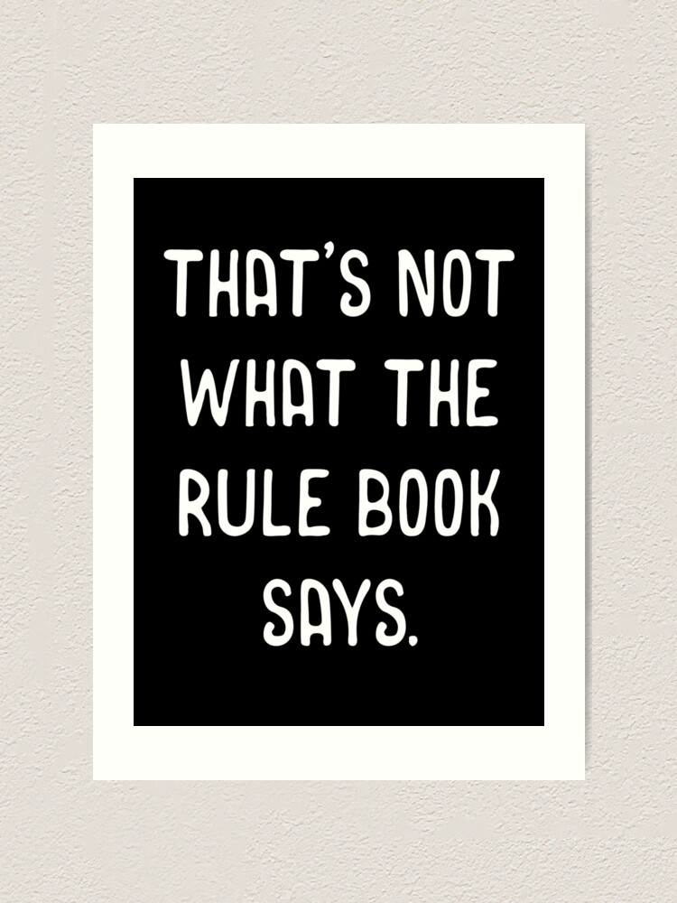
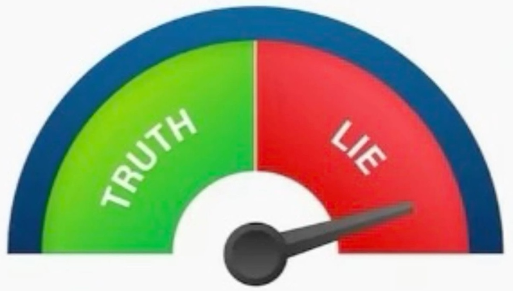

## **Language as a Cognitive Ability**
 
.pull-left[
- a native speaker of a language L knows a lot about L:
  - possible/impossible <b>sounds</b> and <b>sound combinations</b> of L
  - possible/impossible <b>sentences</b> of L
  - possible/impossible <b>meanings of novel sentences</b>  
- but this knowledge is **unconscious**  
- linguists investigate what this **unconscious knowledge** consists of  
- in other words, linguistics is **descriptive** and linguists try to “recover the unconsciousness”
  - describe how people naturally speak
]
.pull-right[
 

]

---
## **Competence and Performance**
 
.pull-left[

]
.pull-right[
- we are concerned with what a person knows (**competence**)
  - the principles and rules they follow (even unconsciously)
  - these rules underlie speakers’ <b>ability to form and understand</b> an infinite number of novel sentences
  - <b>abstract</b>, <b>internal</b> knowledge of language  
- this is different from how a person actually ends up putting this knowledge to use (**performance**)
  - you still have your language competence when you are sleeping, in absence of any performance
  - you might occasionally misspeak a word, but that does not mean your competence is impaired
]

---
## **Competence and Performance**
 
.pull-left[

]
.pull-right[
- we are concerned with what a person knows (**competence**)
  - the principles and rules they follow (even unconsciously)
  - these rules underlie speakers’ <b>ability to form and understand</b> an infinite number of novel sentences
  - <b>abstract</b>, <b>internal</b> knowledge of language  
- *I ain't got no time.*
  - **good**, we understand, accept and use it
  - **bad**, double negation is not allowed   

- a sentence can be both **good** and **bad** at the same time?
  - **prescriptivism** vs. **descriptivism**   
]

---
class:middle, center

Prescriptive vs. Descriptive

---
## **Prescriptive vs. Descriptive**
 
.pull-left[
- we are concerned with what a person knows (**competence**)
  - the principles and **rules** they follow (even unconsciously)
  - these **rules** underlie speakers’ <b>ability to form and understand</b> an infinite number of novel sentences  
- be cautious when we talk about **RULES**  
- often the grammar rules we are taught at school are **prescriptive** rules of “good grammar”
  - rules about what is appropriate/correct way to use the language
]
.pull-right[

]

---
## **Prescriptive Rules**
 
.pull-left[
- **prescriptive rules**: rules that tell people how they <b>should</b> and <b>shouldn't</b> speak (or write)
  - stipulates **right** vs <b>wrong</b> 
  - usually require some effort to learn
  - often broken  

- <b><i>ex. 1</i></b>: Don’t end a sentence with a preposition!
  - <i>prepositions are words you don’t end a sentence **with**</i>.
- <b><i>ex. 2</i></b>: Don’t split infinitives!
  - <i>**To** boldly **go** where no one has gone</i>.
- <b><i>ex. 3</i></b>: Don't use double negatives!
  - <i>I **ain't** got **no** satisfaction</i>.  

- prescriptive rules **can run counter** to our native competence
]
.pull-right[

]

---
## **Prescriptive Rules vs. Descriptive Rules**
 
.pull-left[]
.pull-right[
- **prescriptive rules**: rules that tell people how they <b>should</b> and <b>shouldn't</b> speak (or write)
  - stipulates **right** vs <b>wrong</b> 
  - usually require some effort to learn
  - often broken  
- **descriptive rules**: rules that objectively describe how people use their language
  - often learned and used tacitly  
- these are the ‘rules’ that linguists study
  - the goal of linguistics is to <b>develop a theory</b> that correctly models <b>native speaker’s knowledge</b> of their language
  - only studying on **descriptive rules** can we maintain a <b>neutral</b> and <b>scientific</b> point of view
  - and it shows **respects**
]
  
---
class: middle,center
## **How do linguists come up with the descriptive rules?**
  
how do they come up with the generalizations that native speakers implicitly know?

how do linguists investigate ‘the cognitive ability of language’?  

--
## **scientific methods**

---
## **Linguistic Analysis (One of Scientific Methods)**
 
.pull-left[ 
- Linguistics is the **scientific** study of languages  
- science uses the scientific method to test hypotheses about how natural phenomena (in our case, language) work:  
1. make **empirical observations** and form generalizations (descriptive rules)
2. form **hypotheses** which make **falsifiable predictions**
3. **test** these predictions by collecting further data
4. **revise** hypothesis based on gathered data
]
.pull-right[
  

]

---
## **Linguistic Analysis (One of Scientific Methods)**
 
.pull-left[ 
- Linguistics is the **scientific** study of languages  
- science uses the scientific method to test hypotheses about how natural phenomena (in our case, language) work:  
1. make **empirical observations** and form generalizations (descriptive rules)
2. form **hypotheses** which make **falsifiable predictions**
3. **test** these predictions by collecting further data
4. **revise** hypothesis based on gathered data
]
.pull-right[ 
<b>a simple example</b>  
1. I found everyone around me is a linguist (**observation**)  
2. I thought that every Rutgers student is a linguist (**hypothesis**)  
3. I went out and asked every one (**experiment**)  
4. I found a Rutgers student who is actually mathematician (**reject**)  
5. I have a new hypothesis! (**repeat**)
]

---
class:middle, center

Toy Example Applying Scientific Method   
how does CONTRACTION work in English

---
## **Step 1: Observation**
 
.pull-left[
- in casual spoken English, the verb be may be used in either its **full or reduced (contracted) forms**:  
  - (Where is the train?)
  - <i>**It is** at Penn Station</i>.
  - <i><b>It’s</b> at Penn Station</i>.  
  - (Pointing at Merlin)
  - <i>**He is** the best candidate for the job</i>.
  - <i><b>He’s</b> the best candidate for the job</i>.  
  - <i>**We are** happy when we are together</i>.
  - <i><b>We’re</b> happy when we are together</i>.
]
.pull-right[

]

---
### **Step 2: Generalisation**
 
.pull-left[
- an English speaker knows that the reduced form of **BE** may appear wherever its full form appears
         

### **Step 3: Initial Hypothesis**
 
- contraction is <b>fully optional</b>
]
.pull-right[

]

---
## **Step 4: Test Hypothesis**
 
.pull-left[
- gather more data/observations to test the **Initial Hypothesis**   
  - (two people are waiting for the train. One says to the other...)
  - <i>I wonder where **it is**</i>.
  - \* <i>I wonder where <b>it's</b>.  
  - <i>Everyone thinks that Merlin is the best candidate for the job and in fact **he is**</i>.
  - \* <i>Everyone thinks that Merlin is the best candidate for the job and in fact <b>he's</b></i>.
]
.pull-right[

]

---
## **Step 5: Revise Hypothesis**
 
.pull-left[
- ~~contraction is <b>fully optional</b>~~   
- a reduced form of be may appear wherever its full form may appear, **unless it occurs at the very end of a sentence**   
  - (two people are waiting for the train. One says to the other...)
  - <i>I wonder where **it is**</i>.
  - \* <i>I wonder where <b>it's</b>.  
  - <i>Everyone thinks that Merlin is the best candidate for the job and in fact **he is**</i>.
  - \* <i>Everyone thinks that Merlin is the best candidate for the job and in fact <b>he's</b></i>.
]
.pull-right[

]

---
## **Step 6: Go Back to Data**
 
.pull-left[
- a reduced form of be may appear wherever its full form may appear, **unless it occurs at the very end of a sentence**   

- but still...
  - <i>They will never be as happy as we are when **we are** together</i>.
  - \* <i>They will never be as happy as <b>we're</b> when we are together</i>.  
  - <i>I wonder where **it is** right now</i>.
  - \* <i>I wonder where <b>it's</b> right now</i>.
]
.pull-right[

]

  
---
## **From our Toy Example...**
 
.pull-left[

]
.pull-right[
- our hypothesis is **falsified** and it’s important that the hypothesis is <b>falsifiable</b>  
- we are **predicting** something at least  
- English speakers know a rather **sophisticated** rule that governs the use of reduced forms  
- this rule is just one small piece of an immensely rich body of knowledge that English speakers acquire without any explicit instruction, and which remains **below the level of conscious awareness**  
- coming up with a descriptive rule that correctly depict linguistics phenomenon is **HARD**
]

---
## **Exercise: Applying Scientific Methods on Agta**
 
.pull-left[

]
.pull-right[   ]

---
## **Exercise: Applying Scientific Methods on Agta**
 
Consider the following word forms in Agta. In this language, there is a process to form **diminutives**. Based on the words, how might we describe diminutive formation in Agta? 
  
.pull-left[
.pull-left[
wer  
**balabahuy**  
talobag  
**palapirak**  
bag  
bahuy  
**walawer**  
**balabag**
]
.pull-right[
'creek'  
'little pig'  
'beetle'  
'little mony'  
'loincloth'  
'pig'  
'little creek'  
'little loincloth'
]
]

--

.pull-right[
.pull-left[
wer  
bahuy  
bag   
<b>?</b>
]
.pull-right[
**wala**wer  
**bala**bahuy  
**bala**bag   
**pala**pirak
]
]

---
## **Exercise: Applying Scientific Methods on Agta**
 
Consider the following word forms in Agta. In this language, there is a process to form **diminutives**. Based on the words, how might we describe diminutive formation in Agta? 
  
.pull-left[
.pull-left[
wer  
**balabahuy**  
talobag  
**palapirak**  
bag  
bahuy  
**walawer**  
**balabag**
]
.pull-right[
'creek'  
'little pig'  
'beetle'  
'little mony'  
'loincloth'  
'pig'  
'little creek'  
'little loincloth'
]
]

--

.pull-right[
- to form a diminutive, attach **[Xala]** at the beginning of the word, where **X** is the same sound as the **initial sound** of the word  
- what do we predict the diminutive of ***talobag*** ‘beetle’ to be?  
- how might we test to see if our **prediction** is right?
]

---
## **Descriptive Rules are Often Tacit**
 
.pull-left[

]
.pull-right[
- the scientific method can be used to uncover descriptive rules of languages we may be **unfamiliar with**  
- we can also use it to uncover descriptive rules of a language we ourselves speak  
  - even though a native speaker knows a lot about their language, **the descriptive rules still need to be uncovered through the scientific method**  
  - this is because descriptive rules are usually **tacit**: we are not consciously aware we are using them
]
  
---
## **Grammatical vs. Ungrammatical**
 
.pull-left[
- **grammatical**: language that would be **said and understood** by a native speaker, and would sound **natural** to a native speaker  
- **ungrammatical**: language that would **NOT** be said or understood by a native speaker  
  - $*$ <i>John has finishing his homework</i>.
  - $*$ <i>This apples is delicious</i>.  
- speakers may disagree on what is grammatical based on their own mental grammar   
- language can be **non-standard** but still **grammatical**  
  - <i>How about them apples!</i>
  - <i>I don't want none!</i>
]
.pull-right[
   

]

---
## **Standard vs. Non-standard Language**
 
.pull-left[
- since we take **descriptivism**, we need to **avoid** judgmental terms   
  - ~~bad grammar~~
  - ~~incorrect language~~
  - ~~broken English~~
  
- **standard language**: the variety taught in schools and used in **formal and official settings** like the workplace, education, government, newsmedia, textbooks, etc.
  
- **non-standard language**: other varieties used in more colloquial settings   
- the standard variety is often a bit artificial and no one speaks that way all the time
]

.pull-right[

  
- people may disagree on what counts as standard or non-standard
- non-standard language may be **stigmatized** in some cases, but - it is just as legitimate and expressive as standard language. There is nothing inherently "better" or "worse" about any variety or language
]

---
## **Rules are Variable**
 
.pull-left[
- We've seen that language follows mental rules, and that non-standard varieties also have rules  
- Another important point: the rules of language are often variable  
- Not everyone speaks the same, and not everyone has the same mental rules  
- Grammar often varies by region, community, and other social factors but no matter where you're from, you still have a mental grammar
]

.pull-right[

Each one of these sentences is used in one or more varieties of American English. Which of them sound natural to you? If not, how would you say it?
  
1. She was standing on line for tickets.
2. It’s a quarter of three in the afternoon.
3. I thought you might could help me.
4. Do you want to come with?
5. He doesn’t have no time.
6. I'm finished my homework.
7. My shirt needs washed.
8. He had went to the store.

 
(*Visit the [Yale Grammatical Diversity Project](https://ygdp.yale.edu/) for more info about each of these grammatical phenomena.*)
]

---
## **Subfields of Linguistics**
 
.pull-left[
Major subfields of linguistics are:  
- **Phonetics** – physical attributes of speech sounds  
- **Phonology** – speech sounds considered as a system  
- **Morphology** – structure of words  
- **Syntax** – structure of sentences  
- **Semantics** – literal meaning  
- **Pragmatics** – implied meaning  
]
.pull-right[

  
*Colorless green ideas sleep furiously*.
]

---
## **Subfields of Linguistics**
 
.pull-left[
Major subfields of linguistics are:  
- **Phonetics** – physical attributes of speech sounds  
- **Phonology** – speech sounds considered as a system  
- **Morphology** – structure of words  
- **Syntax** – structure of sentences  
- **Semantics** – literal meaning  
- **Pragmatics** – implied meaning
]

.pull-right[
Other subfields:  
- Sociolinguistics  
- Linguistic Anthropology  
- Historical Linguistics  
- Psycholinguistics  
- Neurolingusitics  
- Language Acquisition / Second Language Acuisition  
- Computational Linguistics  
- Forensic Linguistics
]

---
.pull-left[
## **Two Truths and A Lie**
]
.pull-right[

]
 
#### **group I**
1. you can do linguistic experiments on yourself
2. an adult can learn a foreign language, but never to a native level
3. there is one and only sign language in the world  

--

#### **group II**
1. children need to be taught language formally in order to learn it
2. parents don’t need to correct their children’s speech errors in order for them to acquire a language
3. English originated in what is now northwest Germany and the Netherlands  

--

#### **group III**
1. native speakers of some languages might have difficulties hearing certain sounds of other languages not present in their native language
2. linguists speak a lot of languages
3. Linguistics focuses specifically on studying humans (rather than studying animals or animal/humans comparisons)

---
.pull-left[
## **Two Truths and A Lie**
]
.pull-right[

]
 
#### **group I**
1. you can do linguistic experiments on yourself ✅
2. an adult can learn a foreign language, but never to a native level ✅
3. there is one and only sign language in the world ❌  

#### **group II**
1. children need to be taught language formally in order to learn it ❌
2. parents don’t need to correct their children’s speech errors in order for them to acquire a language ✅
3. English originated in what is now northwest Germany and the Netherlands ✅  

#### **group III**
1. native speakers of some languages might have difficulties hearing certain sounds of other languages not present in their native language ✅
2. linguists speak a lot of languages ❌
3. Linguistics focuses specifically on studying humans (rather than studying animals or animal/humans comparisons) ✅

---
class: center, middle
**no homework** is due this week  
<b>readings</b> Sections 4.0, 4.1 and 4.2 of Chapter 4: Morphology from <i>Language Files</i>  

  
Slides created via the R package [**xaringan**](https://github.com/yihui/xaringan).
