class: center, middle
## Please pick up your **name card** from the front

---
## **Previously on 201: What is Linguistics**
 
.pull-left[
- Linguistics is the <u><b>scientific</b></u> study of language
  
- linguists use the scientific method to uncover the <u><b>combetence</b></u> or knowledge of language users
  
- while there are both prescriptive and descriptive rules relating to language, linguists are interested in uncovering the <u><b>describtive</b></u> rules of a language
  
- often times these rules are <u><b>tacit</b></u>, hence speakers are not aware that they are following them
  
- we can use the scientific method to uncover rules of languages we ourselves speak or languages we are unfamiliar with
]
.pull-right[
  
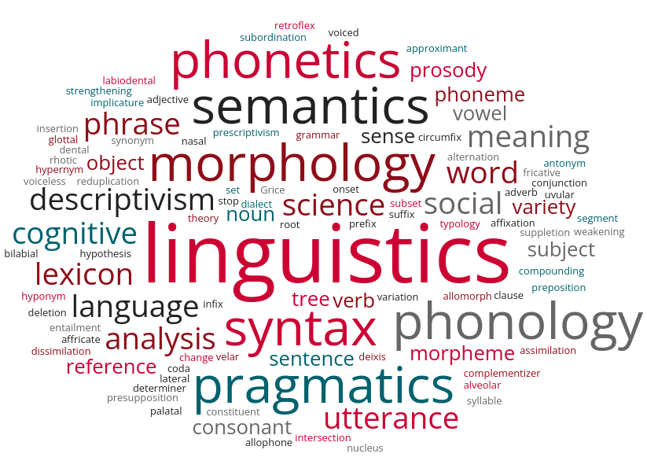
]

---
## **Previously on 201: What is Linguistics**
 
.pull-left[
- Linguistics is the <u><b>scientific</b></u> study of language
  
- linguists use the scientific method to uncover the <u><b>competence</b></u> or knowledge of language users
  
- while there are both prescriptive and descriptive rules relating to language, linguists are interested in uncovering the <u><b>descriptive</b></u> rules of a language
  
- often times these rules are <u><b>tacit</b></u>, hence speakers are not aware that they are following them
  
- we can use the scientific method to uncover rules of languages we ourselves speak or languages we are unfamiliar with
]
.pull-right[
  

]

---
## **Different Parts of Linguistic Competence**
 
.pull-left[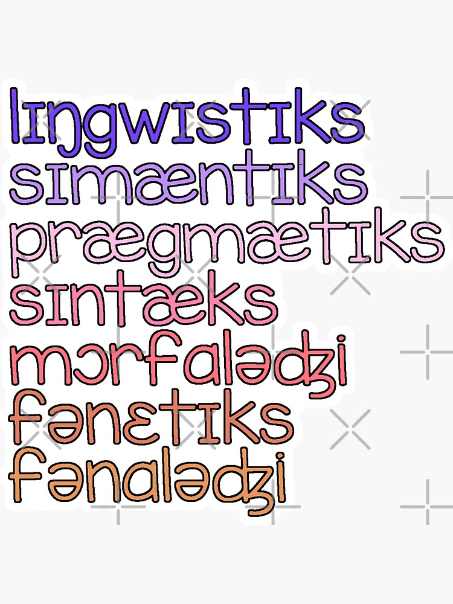]
.pull-right[
- Linguistics is the scientific study of human languages  
  - <u>**Morphology studies word structure**</u>  
  - **Syntax** studies <b>sentence</b> structure  
  - **Semantics** studies <b>literal meaning</b> of words and sentences  
  - **Pragmatics** studies <b>contextual meaning</b> of words and sentences  
  - **Phonetics** studies speech <b>sounds</b>  
  - **Phonology** studies <b>sound patterns</b>
]

---
class:middle, center

Morphology

---
## **What are Words**
 
As we said, Morphology studies **word structure**, but what are words?
  
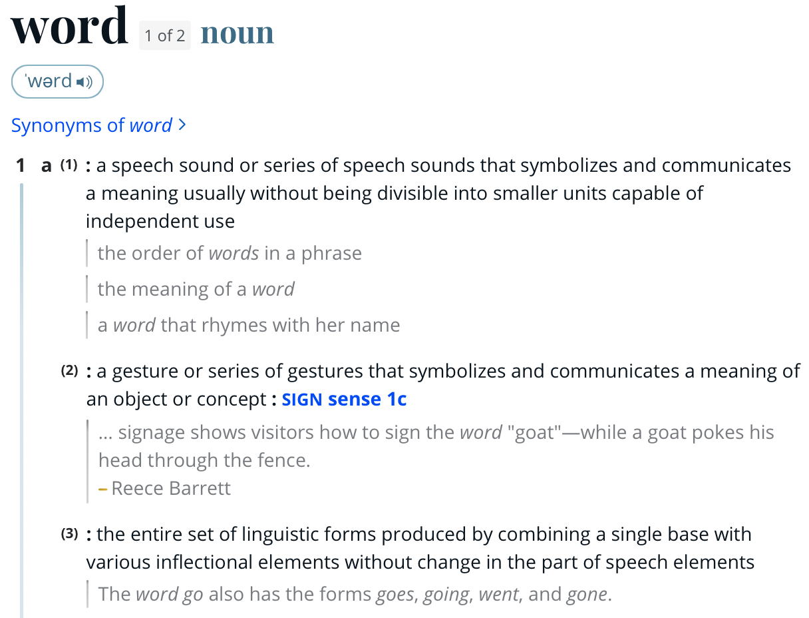
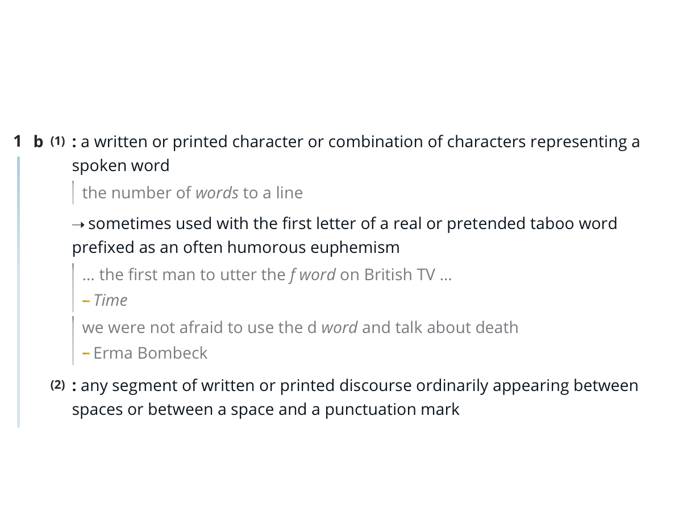
  

  <a href="https://www.merriam-webster.com/dictionary/word">definition of '<b>word</b>' from <i>Merriam Webster Dictionary</i></a>

---
## **What are Words**

<h3><b>dog</b></h3>
<h3><b>[dɑɡ] (Amer.)  / [dɔg] (Brit.)</b></h3>
  
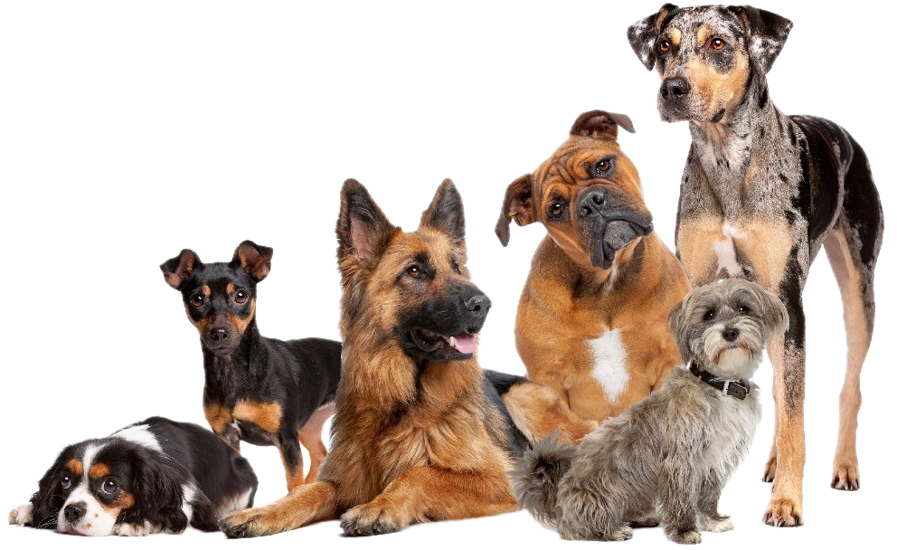

---
## **Some Relations are Arbitrary**
 
.pull-left[
- as pointed out by **Ferdinand de Saussure** the relationship between sound/sign and meaning appears to be **arbitrary**  
- the fact that the sound [dɑg] has a meaning ‘a domesticated carnivorous mammal’ <u>does NOT appear to rely on</u> special properties of those sounds in that order   
- what is ‘a domesticated carnivorous mammal’ in other languages?
]
.pull-right[

  
*Ferdinand Mongin de Saussure* (1857-1913)
]
 
---
## **Looking at Different Languages**
 
.pull-left[
- sound-meaning arbitrariness becomes clear when we look at **other languages**  
- the <b>same meaning</b> associated with <b>different sounds</b>  
  - inu (Japanese)
  - gae (Korean)
  - aso (Tagalog)
  - hundur (Icelandic)
  - Hund (German)...  
- or the <b>same sound</b> associated with <b>different meaning</b>   
  - [qhurt] in **Kazakh** 
  ‘insect’  
  ‘a type of food made from milk’
]
.pull-right[

 
<i>Inuyasha</i>

]

---
class:middle, center

How are words stored in our mind?

---
## **Mental Dictionary (Lexicon)**
 
- part of language learning then is learning and memorizing these **meaning-sound pairs** and storing them in your **mental dictionary** (aka **lexicon**)  
- each item in the lexicon is a **lexical entry**  
- we know that part of each lexical entry is its *phonological representation* (written in IPA) and its *semantic representation*  
<table style="width:50%; border-collapse:collapse;">
  <tr>
    <td style="width:15%; text-align:center; border:1px solid black;">label</td>
    <td style="width:15%; text-align:center; border:1px solid black;">'dog'</td>
    <td style="width:15%; text-align:center; border:1px solid black;">'teach'</td>
  </tr>
  
  <tr>
    <td style="width:15%; text-align:center; border:1px solid black;"><b>phonological representation</b></td>
    <td style="width:15%; text-align:center; border:1px solid black;">/dɑg/</td>
    <td style="width:15%; text-align:center; border:1px solid black;">/tiːtʃ/</td>
  </tr>
  
  <tr>
    <td style="width:15%; text-align:center; border:1px solid black;"><b>semantic representation</b></td>
    <td style="width:15%; text-align:center; border:1px solid black;">{x: x is a dog}</td>
    <td style="width:15%; text-align:center; border:1px solid black;">{&lt;x, y&gt;: x teaches y}</td>
  </tr>
</table>

---
## **Compositionality**
 
.pull-left[
- **NOT** all pairs of sounds and meanings are arbitrary (actually most aren't)  
- the following string of phones (sounds) has a **predictable** meaning  
- and is almost certainly **NOT** stored as a single lexical entry  
  - [mɜːlɪns titʃər wɑkt kwɪkli] 
  'Merlin’s teacher walked quickly.'  
- the meaning of this string is predictable from the meanings of its parts  
- it is **COMPOSITIONAL**
]
.pull-right[
  
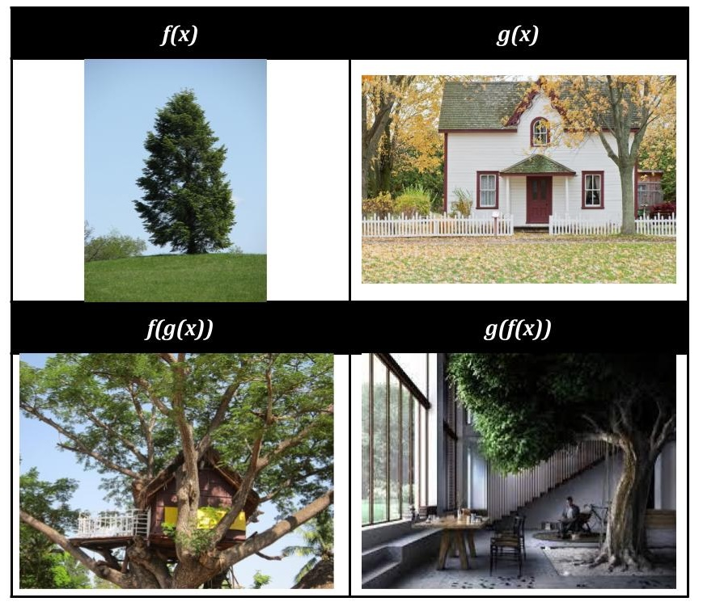
  

'*compositionality*'

]

---
## **Compositionality**
 
.pull-left[
  - [<b>mɜːlɪns</b> <b>titʃər</b> <b>wɑkt</b> <b>kwɪkli</b>] 
  '<b>Merlin’s</b> <b>teacher</b> <b>walked</b> <b>quickly</b>.'  

How is each word in the sentence **compositional**?
]

.pull-right[
  

  

'*compositionality*'

]

---
## **Compositionality**
 
.pull-left[
  - [<b>mɜːlɪns</b> <b>titʃər</b> <b>wɑkt</b> <b>kwɪkli</b>] 
  '<b>Merlin’s</b> <b>teacher</b> <b>walked</b> <b>quickly</b>.'  

How is each word in the sentence **compositional**?  

- words like <b>Merlin’s</b> and <b>teacher</b> **CAN** be broken down 
- and their meaning seems to contain the meaning of the pieces  
- while a word like **dog**, **CANNOT** be broken down into smaller meaningful units 
- it could be broken down into smaller sounds, but those sounds do not correspond to a meaning on their own
]

.pull-right[
<b>Merlin’s</b> and <b>teacher</b>
  - morphologically complex words 
  
**dog** and **teach**
  - morphologically simple words  

]

---
class: middle, center
# **How many meaningful units?**
  
### teacher <b>teach-er</b>
  
###presidential <b>president-ial</b>
  
###unlockable <b>un-lock-able</b>
  
###antidisetablishmentarianism <b>anti-dis-establish-ment-ar(y)-ian-ism</b>
 
---
class: middle, center
# **How many meaningful units?**
  
### teacher <b>teach-er</b>
  
###presidential <b>president-ial</b>
  
###unlockable <b>un-lock-able</b>
  
###antidisetablishmentarianism <b>anti-dis-establish-ment-ar(y)-ian-ism</b>

---
class: middle, center
### so we see systematic **PATTERNS** in the meanings of complex words
  
  hospital, hospital**ise**, hospital**isa**<b>tion</b>  
  refute, refut**able**, <b>ir</b>refut**able**, irrefut**abl**<b>ity</b>

---
## **Trickier Cases**
 
.pull-left[
  
- is the word **spot** complex because it contains the same sounds as the word **pot**? Why or why not?    
- is the word **chef** complex because it appears to contain the meaning of the word **cook**? The pair **cook**-**chef** appears to be the same relation that holds between **teach**-**teacher** 
]
.pull-right[
   
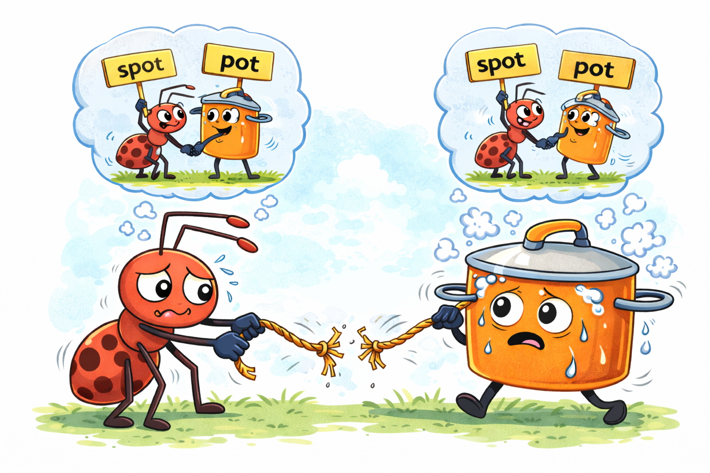
]

---
## **Zooming in on *-er***
 
.pull-left[
- what do these words all have **in common** in terms of their meaning? 
  
  - teach**er**
  - driv**er**
  - lectur**er**
  - read**er**
  - soften**er**
  - whiten**er**
  - blend**er**
  - moderniz**er**  
- -er seems to have a **shared and stable meaning**, something like '<i>one who does X action</i>', where X is a **verb**
]
.pull-right[
   
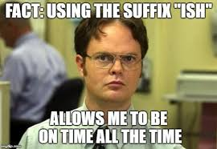
]

---
## **Zooming in on *-er***
 
.pull-left[
  
- *-er* is used **productively**  
- it can be used to create novel words  
- the verb **yeet** is a fairly new verb  
- if you know the meaning of **yeet**  
- the term **yeeter** is easily understandable  
- even if you have never heard it before
]
.pull-right[
   

]

---
class: center, middle
## **Lexical Entries**
   
<table style="width:60%; border-collapse:collapse;">
  <tr>
    <td style="width:15%; text-align:center; border:1px solid black;">label</td>
    <td style="width:20%; text-align:center; border:1px solid black;">'-er'</td>
    <td style="width:20%; text-align:center; border:1px solid black;">'un-'</td>
    <td style="width:20%; text-align:center; border:1px solid black;">'-able'</td>
  </tr>
  
  <tr>
    <td style="width:15%; text-align:center; border:1px solid black;"><b>phonological representation</b></td>
    <td style="width:20%; text-align:center; border:1px solid black;">/ər/</td>
    <td style="width:20%; text-align:center; border:1px solid black;">/ʌn/</td>
    <td style="width:20%; text-align:center; border:1px solid black;">/ʌbəl/</td>
  </tr>
  
  <tr>
    <td style="width:15%; text-align:center; border:1px solid black;"><b>semantic representation</b></td>
    <td style="width:20%; text-align:center; border:1px solid black;">one who does <i>X</i></td>
    <td style="width:20%; text-align:center; border:1px solid black;">not <i>X</i></td>
    <td style="width:20%; text-align:center; border:1px solid black;">able to be <i>X</i>-ed</td>
  </tr>
</table>

---
## **Morphemes**
 
### teach, dog, fish and -er, un-, -able are all **morphemes**
  
.pull-left[
 

]
.pull-right[
  
**morpheme**
- the minimal unit of phonology-meaning correspondence.
- in other words, a morpheme is a string of sounds whose meaning cannot be broken down into smaller meaningful units   
]

---
class: middle, center
# ***morpheme*** 
  
## <b>smallest linguistic unit</b> with <b>meaning</b>

---
## **Smallest Linguistic Unit** with Meaning
 
.pull-left[
- **smallest linguistic unit** means shortest sequence of sounds  
- what's the **shortest** sequence of sounds with meaning you can
**break** these words into?
]
.pull-right[
.pull-left[
   
<b><i>schoolbus</i></b>  
<b><i>bee</i></b>  
<b><i>elephant</i></b>  
<b><i>opener</i></b>  
<b><i>silliest</i></b>
]
.pull-right[]
]

---
## **Smallest Linguistic Unit** with Meaning
 
.pull-left[
- we use **hyphens** (-) to indicate morpheme boundaries  
- morphemes are **NOT** the same as syllables:
  - *elephant* has three syllables, but only <b>one</b> morpheme
  - *el*, *e*, *phant* don’t mean anything – they’re syllables, but not morphemes  
- morphemes are made of **sounds**, NOT letters:
  - *silly* and *silli*- are two ways of spelling the same morpheme
  - same with *big*, *bigg*-er and *lie*, *ly*-ing
  - don’t worry about spelling differences
]
.pull-right[
.pull-left[
   
<b><i>school-bus</i></b>  
<b><i>bee</i></b>  
<b><i>elephant</i></b>  
<b><i>open-er</i></b>  
<b><i>silli-est</i></b>
]
.pull-right[]
]

---
## **Smallest Linguistic Unit** with Meaning
 
.pull-left[
- note that it’s OK for a word to have **just one** morpheme
  - every word has at least one morpheme, some have more  
- words with one morpheme are called **monomorphemic** or **simplex words**
  - *bee*, *elephant*  
- words with two or more morphemes are **polymorphemic** or **complex words**
  - *school-bus*, *open-er*, *silli-est*  
- sometimes you’ll hear terms like **bimorphemic** or **trimorphemic**
  - what do you think they mean?
]
.pull-right[
.pull-left[
   
<b><i>school-bus</i></b>  
<b><i>bee</i></b>  
<b><i>elephant</i></b>  
<b><i>open-er</i></b>  
<b><i>silli-est</i></b>
]
.pull-right[]
]

---
## Smallest Linguistic Unit with **Meaning**
 
- morphemes can have two types of **meaning**:
   

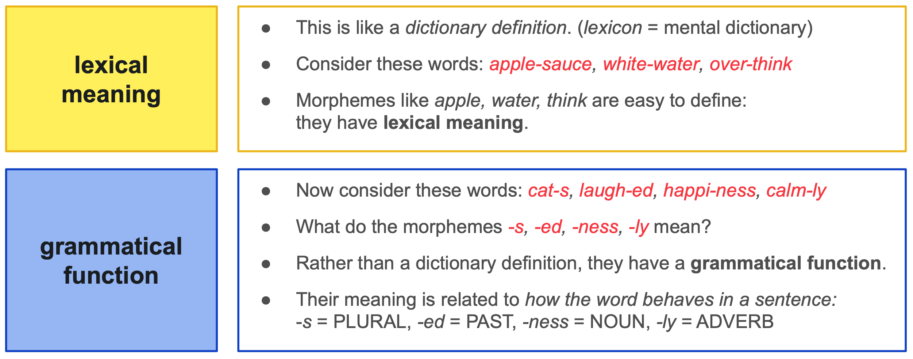

---
## **Exercise: Finding Morphemes 1**
 
Which of the following words contain the morpheme **–un** with the phonological form **/ʌn/**? And which are not?  
.pull-left[
.pull-left[
unfaithful  
unlawful  
untreated  
untouched
]
.pull-right[
unthinkable  
unhappy  
unable  
unclear
]
]
.pull-right[
.pull-left[
untied  
until  
unsuspecting  
unpretentious
]
.pull-right[
underwear  
undershirt  
unprepared  
underprepared
]
]

---
## **Exercise: Finding Morphemes 1**
 
Which of the following words contain the morpheme **–un** with the phonological form **/ʌn/**? And which are not?  
.pull-left[
.pull-left[
unfaithful  
unlawful  
untreated  
untouched
]
.pull-right[
unthinkable  
unhappy  
unable  
unclear
]
]
.pull-right[
.pull-left[
untied  
until ❌  
unsuspecting  
unpretentious
]
.pull-right[
underwear ❌  
undershirt ❌  
unprepared  
underprepared ❌
]
]

---
## **Exercise: Finding Morphemes 2**
 
.pull-left[
Break these words down into morphemes, then discuss with a partner:  
- is <i>-lessness</i> a morpheme?
     
- is <i>un-</i> a morpheme in both *untied* and *uncle*?
      
- is <i>-s</i> a morpheme in both *sleeps* and *lens*?
      
- does <i>er-</i> mean the same thing in both *smaller* and *helper*?
  
]
.pull-right[
  
1. <i>sleeps</i>  
2. <i>sleepless</i>  
3. <i>sleeplessness</i>  
4. <i>lens</i>  
5. <i>smaller</i>  
6. <i>helper</i>  
7. <i>untied</i>  
8. <i>uncle</i>  
]

---
## **Exercise: Finding Morphemes 2**
 
.pull-left[
Break these words down into morphemes, then discuss with a partner:  
- is <i>-lessness</i> a morpheme?
  - **no**, it's two morphemes: *-less* and *-ness*  
- is <i>un-</i> a morpheme in both *untied* and *uncle*?
  - **no**, only in *un-tie-d* because it means something there  
- is <i>-s</i> a morpheme in both *sleeps* and *lens*?
  - **no**, only in *sleep-s* because it means something there  
- does <i>er-</i> mean the same thing in both *smaller* and *helper*?
  - **no**, these morphemes are **homophones**
]
.pull-right[
  
1. <i>sleeps</i>  
2. <i>sleepless</i>  
3. <i>sleeplessness</i>  
4. <i>lens</i>  
5. <i>smaller</i>  
6. <i>helper</i>  
7. <i>untied</i>  
8. <i>uncle</i>  
]

---
class: center middle
### **Should complex words get their own lexical entry?**
  
We have seen that both ***teach*** and ***-er*** have lexical entries should ***teacher*** also have one? Why or why not? 
   
<table style="width:60%; border-collapse:collapse;">
  <tr>
    <td style="width:15%; text-align:center; border:1px solid black;">label</td>
    <td style="width:20%; text-align:center; border:1px solid black;">'teacher'</td>
  </tr>
  
  <tr>
    <td style="width:15%; text-align:center; border:1px solid black;"><b>phonological representation</b></td>
    <td style="width:20%; text-align:center; border:1px solid black;">/tijtʃər/</td>
  </tr>
  
  <tr>
    <td style="width:15%; text-align:center; border:1px solid black;"><b>semantic representation</b></td>
    <td style="width:20%; text-align:center; border:1px solid black;">one who teaches</td>
  </tr>
</table>

---
## **Finding morphemes in other languages**
### (Inuktitut, Eskaleut)
 

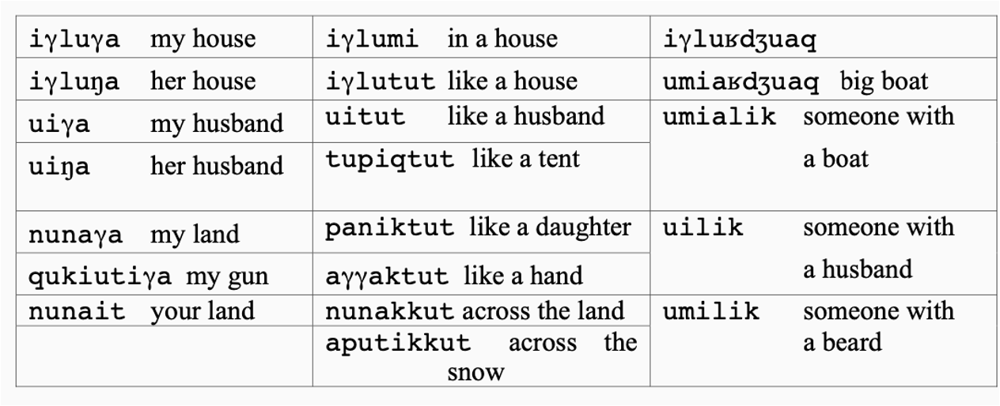

  
<table style="width:60%; border-collapse:collapse;">
  <tr>
    <td style="width:15%; text-align:center; border:1px solid black;">label</td>
    <td style="width:20%; text-align:center; border:1px solid black;">'ighloo'</td>
  </tr>
  
  <tr>
    <td style="width:15%; text-align:center; border:1px solid black;"><b>phonological representation</b></td>
    <td style="width:20%; text-align:center; border:1px solid black;">/iɣlu/</td>
  </tr>
  
  <tr>
    <td style="width:15%; text-align:center; border:1px solid black;"><b>semantic representation</b></td>
    <td style="width:20%; text-align:center; border:1px solid black;">HOUSE</td>
  </tr>
</table>

---
## **Finding morphemes in other languages**
### (Persian, Iranian)
 
Try to match the meanings in (a) through (h) with a **morpheme** in the Persian data.
  - a prefix is marked with a hyphen **following** the morpheme (X-)
  - a suffix is marked with a hyphen **preceding** the morpheme (-X)
    

.pull-left[
.pull-left[
(a) [xarid]  
(b) [mixarid]  
(c) [xaridam]  
(d) [xaridi]
]
.pull-right[
'bought'  
'was buying'  
'I bought'  
'you (sg) bought'
]
]
.pull-right[
.pull-left[
(e) [mixaridid]  
(f) [naxaridam]  
(g) [namixaridand]  
(h) [naxaridim]
]
.pull-right[
'You (pl) were buying'  
'I did not buy'  
'They were not buying'  
'We did not buy'
]
]

---
## **Finding morphemes in other languages**
### (Persian, Iranian)
 
.pull-left[
.pull-left[
(a) [xarid]  
(b) [mixarid]  
(c) [xaridam]  
(d) [xaridi]
]
.pull-right[
'bought'  
'was buying'  
'I bought'  
'you (sg) bought'
]
]
.pull-right[
.pull-left[
(e) [mixaridid]  
(f) [naxaridam]  
(g) [namixaridand]  
(h) [naxaridim]
]
.pull-right[
'You (pl) were buying'  
'I did not buy'  
'They were not buying'  
'We did not buy'
]
]
  
.pull-left[
.pull-left[
.pull-left[

]
.pull-right[
a. I 
b. you (sg) 
c. we 
d. you (pl)
]
]
.pull-right[
.pull-left[
-am 
i 
im 
id
]
.pull-right[

]
]
]
.pull-right[
.pull-left[
.pull-left[

]
.pull-right[
e. they 
f. not 
g. PROG 
h. bought
]
]
.pull-right[
.pull-left[
-and 
na- 
mi- 
xarid
]
.pull-right[

]
]
]

---
## **Finding morphemes in other languages**
### (Persian, Iranian)
 
.pull-left[
.pull-left[
(a) [xarid]  
(b) [mixarid]  
(c) [xaridam]  
(d) [xaridi]
]
.pull-right[
'bought'  
'was buying'  
'I bought'  
'you (sg) bought'
]
]
.pull-right[
.pull-left[
(e) [mixaridid]  
(f) [naxaridam]  
(g) [namixaridand]  
(h) [naxaridim]
]
.pull-right[
'You (pl) were buying'  
'I did not buy'  
'They were not buying'  
'We did not buy'
]
]
  
.pull-left[
.pull-left[
.pull-left[

]
.pull-right[
a. I 
b. you (sg) 
c. we 
d. you (pl)
]
]
.pull-right[
.pull-left[
-am 
i 
im 
id
]
.pull-right[

]
]
]
.pull-right[
.pull-left[
.pull-left[

]
.pull-right[
e. they 
f. not 
g. PROG 
h. bought
]
]
.pull-right[
.pull-left[
-and 
na- 
mi- 
xarid
]
.pull-right[

]
]
]
   

--

is it possible to split <b><i>buy</b></i> and <b><i>PAST</b></i> from these data?

---
## **Finding morphemes in other languages**
### (Persian, Iranian)
 
.pull-left[
.pull-left[
(a) [xarid]  
(b) [mixarid]  
(c) [xaridam]  
(d) [xaridi]
]
.pull-right[
'bought'  
'was buying'  
'I bought'  
'you (sg) bought'
]
]
.pull-right[
.pull-left[
(e) [mixaridid]  
(f) [naxaridam]  
(g) [namixaridand]  
(h) [naxaridim]
]
.pull-right[
'You (pl) were buying'  
'I did not buy'  
'They were not buying'  
'We did not buy'
]
]
  
&nbsp;&nbsp;&nbsp;&nbsp;How would you say the following in Persian?
  
<table style="width:100%; border-collapse:collapse;">
  <tr>
    <td style="width:3%; text-align:left;"></td>
    <td style="width:3%; text-align:left;"></td>
    <td style="width:2%; text-align:left;">i.</td>
    <td style="width:15%; text-align:left;">They were buying.</td>
    <td style="width:15%; text-align:left;">mi-xarid-and</td>
  </tr>
  
  <tr>
    <td style="width:3%; text-align:left;"></td>
    <td style="width:3%; text-align:left;"></td>
    <td style="width:2%; text-align:left;">ii.</td>
    <td style="width:15%; text-align:left;">You (sg) did not buy.</td>
    <td style="width:15%; text-align:left;">na-xarid-i</td>
  </tr>
  
  <tr>
    <td style="width:3%; text-align:left;"></td>
    <td style="width:3%; text-align:left;"></td>
    <td style="width:2%; text-align:left;">iii.</td>
    <td style="width:15%; text-align:left;">You (sg) were buying.</td>
    <td style="width:15%; text-align:left;">mi-xarid-i</td>
  </tr>
</table>

---
## **Finding morphemes in other languages**
### (Persian, Iranian)
 
.pull-left[
.pull-left[
(a) [xarid]  
(b) [mixarid]  
(c) [xaridam]  
(d) [xaridi]
]
.pull-right[
'bought'  
'was buying'  
'I bought'  
'you (sg) bought'
]
]
.pull-right[
.pull-left[
(e) [mixaridid]  
(f) [naxaridam]  
(g) [namixaridand]  
(h) [naxaridim]
]
.pull-right[
'You (pl) were buying'  
'I did not buy'  
'They were not buying'  
'We did not buy'
]
]
  
&nbsp;&nbsp;&nbsp;&nbsp;How would you say the following in Persian?
  
<table style="width:100%; border-collapse:collapse;">
  <tr>
    <td style="width:3%; text-align:left;"></td>
    <td style="width:3%; text-align:left;"></td>
    <td style="width:2%; text-align:left;">i.</td>
    <td style="width:15%; text-align:left;">They were buying.</td>
    <td style="width:15%; text-align:left;">mi-xarid-and</td>
  </tr>
  
  <tr>
    <td style="width:3%; text-align:left;"></td>
    <td style="width:3%; text-align:left;"></td>
    <td style="width:2%; text-align:left;">ii.</td>
    <td style="width:15%; text-align:left;">You (sg) did not buy.</td>
    <td style="width:15%; text-align:left;">na-xarid-i</td>
  </tr>
  
  <tr>
    <td style="width:3%; text-align:left;"></td>
    <td style="width:3%; text-align:left;"></td>
    <td style="width:2%; text-align:left;">iii.</td>
    <td style="width:15%; text-align:left;">You (sg) were buying.</td>
    <td style="width:15%; text-align:left;">mi-xarid-i</td>
  </tr>
</table>

---
## **Lexical Category / Parts of Speech**
 
.pull-left[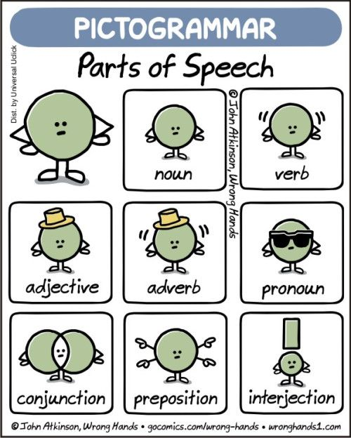]
.pull-right[
- **Noun (N.)**: to name things, people, places, concepts, etc.
  - *water*, *sister*, *sky*  
  - combine with plural morpheme -s; 
  - often ends with -ion/-ment/...; 
  - occur after a determiner, ...  
- <b>Verb (V.)</b>: to show an action or a state 
  - *play*, *think*, *hit*  
  - combine with past morpheme -d, has combined with -ize, ... 
  - follow an auxiliary (does), modal (might), or negation (not), ...
]
  
---
## **Lexical Category / Parts of Speech**
 
.pull-left[]
.pull-right[
- <b>Adjective (Adj.)</b>: to describe a noun, a pronoun or part of a sentence 
  - *tall*, *thin*, *smart*
  - comparative    e.g., bigger
  - superlative   e.g., biggest  
  - combine with un-, has combined with -able, ... 
  - occur between a determiner and a noun, ...   

- <b>Adverb (Adv.)</b>:
  - *carefully*, *intentionally*, *happily*  
  - appear with -ly, ... 
  - can’t appear between a determiner and a noun, ...
]
  
---
## **Lexical Category / Parts of Speech**
 
How do we know that <b>wabe</b> is a **noun**, and that <b>slithy</b> is an **adjective**?
  

Twas brillig, and the slithy toves   
Did gyre and gimble in the wabe;   
All mimsy were the borogoves,   
And the mome raths outgrabe.   

&nbsp;&nbsp;&nbsp;&nbsp;&nbsp;&nbsp;&nbsp;&nbsp;&nbsp;&nbsp;&nbsp;&nbsp;&nbsp;&nbsp;&nbsp;&nbsp;&nbsp;&nbsp;&nbsp;&nbsp;&nbsp;&nbsp;&nbsp;&nbsp;Lewis Carroll, <i>Jabberwocky</i> (1871)

  

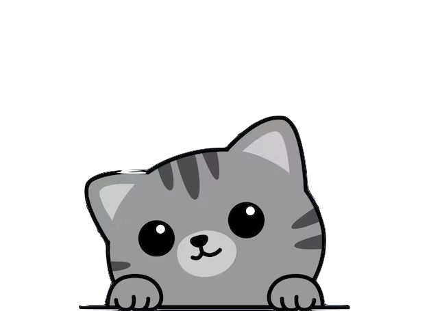
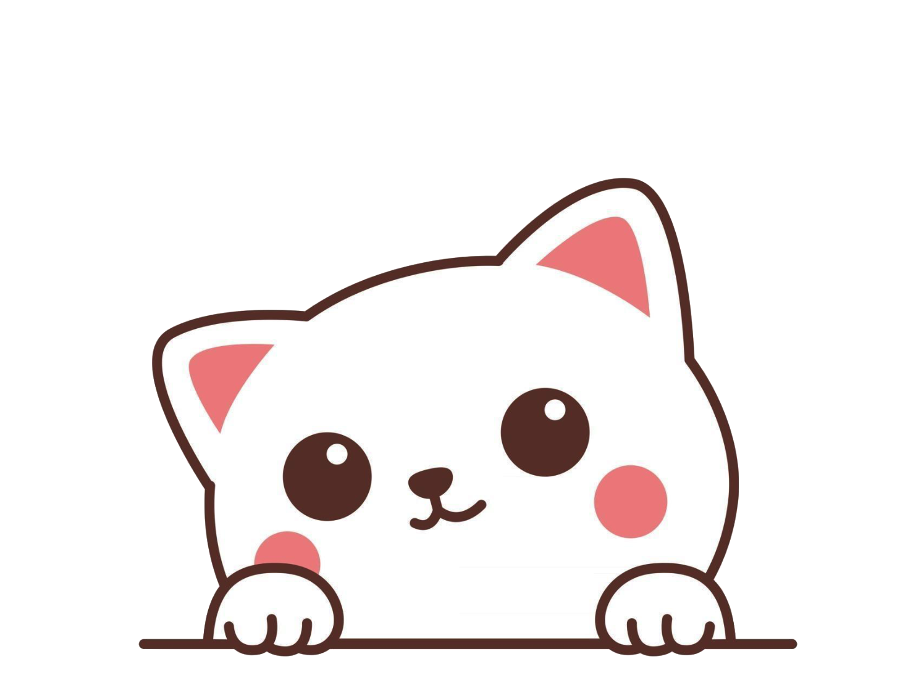

---
## **Exercise: Parts of Speech and Morphemes**
  
<table style="width:100%; border-collapse:collapse;">
  <tr>
    <td style="width:05%; text-align:center;"></td>
    <td style="width:15%; text-align:center; border:1px solid black;">English Example</td>
    <td style="width:15%; text-align:center; border:1px solid black;">Morphemes</td>
    <td style="width:30%; text-align:center; border:1px solid black;">Parts of Speech</td>
  </tr>
  
  <tr>
    <td style="width:05%; text-align:center; font-size:0.5em">-</td>
    <td style="width:15%; text-align:center; border-left:1px solid black;"></td>
    <td style="width:15%; text-align:center;"></td>
    <td style="width:30%; text-align:center; border-right:1px solid black;"></td>
  </tr>
  
  <tr>
    <td style="width:05%; text-align:center;"></td>
    <td style="width:15%; text-align:center; border:1px solid black;">eats</td>
    <td style="width:15%; text-align:center; border:1px solid black;"><i>eat</i>,<i>-s</i></td>
    <td style="width:30%; text-align:center; border:1px solid black;">verb, 3rd person singular</td>
  </tr>
  
  <tr>
    <td style="width:05%; text-align:center;"></td>
    <td style="width:15%; text-align:center; border:1px solid black;">waited</td>
    <td style="width:15%; text-align:center; border:1px solid black;"><i>wait</i>,<i>-ed</i></td>
    <td style="width:30%; text-align:center; border:1px solid black;">verb, past tense</td>
  </tr>
  
  <tr>
    <td style="width:05%; text-align:center;"></td>
    <td style="width:15%; text-align:center; border:1px solid black;">sleeping</td>
    <td style="width:15%; text-align:center; border:1px solid black;"><i>sleep</i>,<i>-ing</i></td>
    <td style="width:30%; text-align:center; border:1px solid black;">verb, progressive</td>
  </tr>
  
  <tr>
    <td style="width:05%; text-align:center;"></td>
    <td style="width:15%; text-align:center; border:1px solid black;">eaten</td>
    <td style="width:15%; text-align:center; border:1px solid black;"><i>eat</i>,<i>-en</i></td>
    <td style="width:30%; text-align:center; border:1px solid black;">verb, perfect</td>
  </tr>
  
  <tr>
    <td style="width:05%; text-align:center;"></td>
    <td style="width:15%; text-align:center; border:1px solid black;">Leo's</td>
    <td style="width:15%; text-align:center; border:1px solid black;"><i>Leo</i>,<i>'s</i></td>
    <td style="width:30%; text-align:center; border:1px solid black;">(proper) noun, possessive</td>
  </tr>
  
  <tr>
    <td style="width:05%; text-align:center;"></td>
    <td style="width:15%; text-align:center; border:1px solid black;">higher</td>
    <td style="width:15%; text-align:center; border:1px solid black;"><i>high</i>,<i>-er</i></td>
    <td style="width:30%; text-align:center; border:1px solid black;">adjective, comparative</td>
  </tr>
  
  <tr>
    <td style="width:05%; text-align:center;"></td>
    <td style="width:15%; text-align:center; border:1px solid black;">smartest</td>
    <td style="width:15%; text-align:center; border:1px solid black;"><i>smart</i>,<i>-est</i></td>
    <td style="width:30%; text-align:center; border:1px solid black;">adjective, superlative</td>
  </tr>
</table>

---
## **Exercise: Parts of Speech and Morphemes**
  
<table style="width:100%; border-collapse:collapse;">
  <tr>
    <td style="width:05%; text-align:center;"></td>
    <td style="width:15%; text-align:center; border:1px solid black;">English Example</td>
    <td style="width:15%; text-align:center; border:1px solid black;">Morphemes</td>
    <td style="width:30%; text-align:center; border:1px solid black;">Parts of Speech</td>
  </tr>
  
  <tr>
    <td style="width:05%; text-align:center; font-size:0.5em">-</td>
    <td style="width:15%; text-align:center; border-left:1px solid black;"></td>
    <td style="width:15%; text-align:center;"></td>
    <td style="width:30%; text-align:center; border-right:1px solid black;"></td>
  </tr>
  
  <tr>
    <td style="width:05%; text-align:center;"></td>
    <td style="width:15%; text-align:center; border:1px solid black;">eats</td>
    <td style="width:15%; text-align:center; border:1px solid black;"><i>eat</i>,<i>-s</i></td>
    <td style="width:30%; text-align:center; border:1px solid black;">verb, 3rd person singular</td>
  </tr>
  
  <tr>
    <td style="width:05%; text-align:center;"></td>
    <td style="width:15%; text-align:center; border:1px solid black;">waited</td>
    <td style="width:15%; text-align:center; border:1px solid black;"><i>wait</i>,<i>-ed</i></td>
    <td style="width:30%; text-align:center; border:1px solid black;">verb, past tense</td>
  </tr>
  
  <tr>
    <td style="width:05%; text-align:center;"></td>
    <td style="width:15%; text-align:center; border:1px solid black;">sleeping</td>
    <td style="width:15%; text-align:center; border:1px solid black;"><i>sleep</i>,<i>-ing</i></td>
    <td style="width:30%; text-align:center; border:1px solid black;">verb, progressive</td>
  </tr>
  
  <tr>
    <td style="width:05%; text-align:center;"></td>
    <td style="width:15%; text-align:center; border:1px solid black;">eaten</td>
    <td style="width:15%; text-align:center; border:1px solid black;"><i>eat</i>,<i>-en</i></td>
    <td style="width:30%; text-align:center; border:1px solid black;">verb, perfect</td>
  </tr>
  
  <tr>
    <td style="width:05%; text-align:center;"></td>
    <td style="width:15%; text-align:center; border:1px solid black;">Leo's</td>
    <td style="width:15%; text-align:center; border:1px solid black;"><i>Leo</i>,<i>'s</i></td>
    <td style="width:30%; text-align:center; border:1px solid black;">(proper) noun, possessive</td>
  </tr>
  
  <tr>
    <td style="width:05%; text-align:center;"></td>
    <td style="width:15%; text-align:center; border:1px solid black;">higher</td>
    <td style="width:15%; text-align:center; border:1px solid black;"><i>high</i>,<i>-er</i></td>
    <td style="width:30%; text-align:center; border:1px solid black;">adjective, comparative</td>
  </tr>
  
  <tr>
    <td style="width:05%; text-align:center;"></td>
    <td style="width:15%; text-align:center; border:1px solid black;">smartest</td>
    <td style="width:15%; text-align:center; border:1px solid black;"><i>smart</i>,<i>-est</i></td>
    <td style="width:30%; text-align:center; border:1px solid black;">adjective, superlative</td>
  </tr>
</table>

---
## **Exercise: Adapted from <i>Language Files</i>**
 
From the examples given for each of the following suffixes, determine:  
  1. the lexical category (i.e. parts of speech) of the **root**
  2. the lexical category (i.e. parts of speech) of the word resulting from the addition of the **suffix**
    

.pull-left[
a. -ive: <u>*repressive*, *active*, *disruptive*, *explosive*</u>  
b. -ion: <u>*invention*, *narration*, *expression*, *pollution*</u>  
c. re-: <u>*reelect*, *resubmit*, *restart*, *recap*, *reactivate*</u>
]
.pull-right[
**-ive** takes <u>verb</u>, yields <u>noun</u>  
**-ion** takes <u>verb</u>, yields <u>noun</u>  
**re-** takes <u>verb</u>, yields <u>noun</u>  
]

---
## **Exercise: Adapted from <i>Language Files</i>**
 
From the examples given for each of the following suffixes, determine: i) the lexical category (i.e. parts of speech) of the root, and ii) the lexical category (i.e. parts of speech) of the word resulting from the addition of the suffix.
  
.pull-left[
a. -ive: <u>*repressive*, *active*, *disruptive*, *explosive*</u>  
b. -ion: <u>*invention*, *narration*, *expression*, *pollution*</u>  
c. re-: <u>*reelect*, *resubmit*, *restart*, *recap*, *reactivate*</u>
]
.pull-right[
**-ive** takes <u>verb</u>, yields <u>adjective</u>  
**-ion** takes <u>verb</u>, yields <u>noun</u>  
**re-** takes <u>verb</u>, yields <u>verb</u>  
]

---
class: center, middle
**no homework** is due this week  
continue <b>reading</b> Sections 4.0, 4.1 and 4.2 of Chapter 4: Morphology from <i>Language Files</i>  
<b>readings</b> Sections 4.3, 4.4 and 4.5 of Chapter 4: Morphology from <i>Language Files</i>  
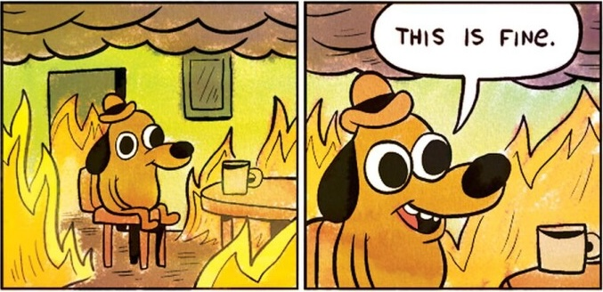
  
Slides created via the R package [**xaringan**](https://github.com/yihui/xaringan).
