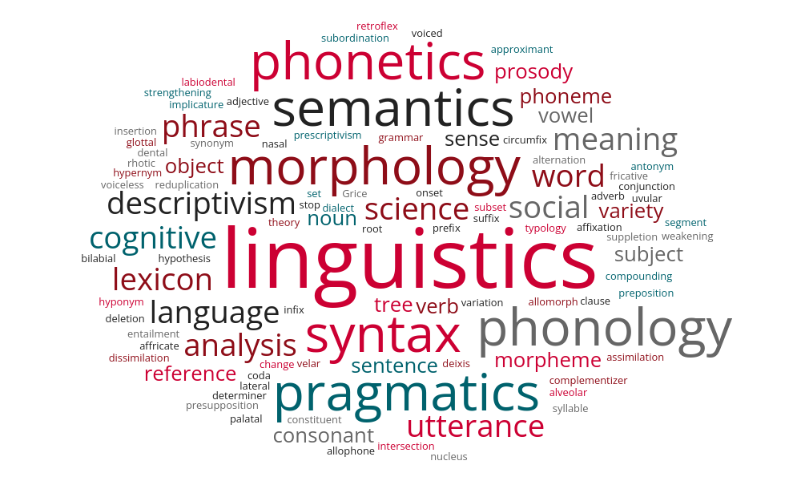

```{r setup, include=FALSE}
knitr::opts_chunk$set(echo = TRUE)
```

<style>
a {
  color: red;
  text-decoration: none;
}
a:hover {
  color: grey;
  text-decoration: underline;
}
</style><br><br>

<table style="width:100%; border-collapse:collapse;">
  <tr>
    <td style="width:65%; vertical-align:middle; padding:1em;">
      <h1>Introduction to Linguistic Theories</h1><br>
      <h4 style="color:grey; margin:0;">Spring, 2026</h4><br>
      <h4 style="color:grey; margin:0;">01:615:201:01</h4><br>
      <h5 style="margin:0;">Linguistics Department, Rutgers University</h5>
    </td>
    <td style="width:35%; text-align:center; vertical-align:middle; padding:1em;">
      
    </td>
  </tr>
</table>

---

This is an R Markdown document serving as the directory. You can find links to the slides and more information of the course *Introduction to Linguistic Theories* (Spring, 2026). May you enjoy taking the course.
<br><br>

### [Syllabus](syllabus.pdf) (clickable)<br>

___
### Tentative Schedule

<table style="width:100%; border-collapse:collapse; font-size:1.2em;">
  <tr>
    <td style="width:2%; text-align:center; vertical-align:top;"></td>
    <td style="width:3%; text-align:left; vertical-align:top;"><b>Week</b></td>
    <td style="width:15%; text-align:center; vertical-align:top;"><b>Date</b></td>
    <td style="width:30%; text-align:left; vertical-align:top;"><b>Topic</b></td>
    <td style="width:48%; text-align:left; vertical-align:top;"><b>Notes</b></td>
    <td style="width:2%; text-align:center; vertical-align:top;"></td>
  </tr>
  
  <tr>
    <td style="width:2%; text-align:center; vertical-align:top;"></td>
    <td style="width:3%; text-align:left; vertical-align:top;">01</td>
    <td style="width:10%; text-align:center; vertical-align:top;">Jan 22</td>
    <td style="width:35%; text-align:left; vertical-align:top;">[Introduction](https://merlinudinov.github.io/spring2026ling201/20260122)</td>
    <td style="width:48%; text-align:left; vertical-align:top;"></td>
    <td style="width:2%; text-align:center; vertical-align:top;"></td>
  </tr>
  
  <tr>
    <td style="width:2%; text-align:center; vertical-align:top;"></td>
    <td style="width:3%; text-align:left; vertical-align:top;">02</td>
    <td style="width:10%; text-align:center; vertical-align:top;">Jan 26</td>
    <td style="width:35%; text-align:left; vertical-align:top;">[Linguistics as a Science](https://merlinudinov.github.io/spring2026ling201/20260126)</td>
    <td style="width:48%; text-align:left; vertical-align:top;"><b><u>Reading</u></b>: <i>Thinking like a Linguist</i></td>
    <td style="width:2%; text-align:center; vertical-align:top;"></td>
  </tr>
  
  <tr>
    <td style="width:2%; text-align:center; vertical-align:top;"></td>
    <td style="width:3%; text-align:left; vertical-align:top;"></td>
    <td style="width:10%; text-align:center; vertical-align:top;">Jan 29</td>
    <td style="width:35%; text-align:left; vertical-align:top;">[Morphology I](https://merlinudinov.github.io/spring2026ling201/20260129)</td>
    <td style="width:48%; text-align:left; vertical-align:top;"><b><u>Reading</u></b>: Sections 4.0, 4.1 and 4.2 of Chapter 4: Morphology from <i>Language Files</i></td>
    <td style="width:2%; text-align:center; vertical-align:top;"></td>
  </tr>
  
  <tr>
    <td style="width:2%; text-align:center; vertical-align:top;"></td>
    <td style="width:3%; text-align:left; vertical-align:top;v">03</td>
    <td style="width:10%; text-align:center; vertical-align:top;">Feb 02</td>
    <td style="width:35%; text-align:left; vertical-align:top;">Morphology II</td>
    <td style="width:48%; text-align:left; vertical-align:top;"></td>
    <td style="width:2%; text-align:center; vertical-align:top;"></td>
  </tr>
  
  <tr>
    <td style="width:2%; text-align:center; vertical-align:top;"></td>
    <td style="width:3%; text-align:left; vertical-align:top;"></td>
    <td style="width:10%; text-align:center; vertical-align:top;">Feb 05</td>
    <td style="width:35%; text-align:left; vertical-align:top;">Morphology III</td>
    <td style="width:48%; text-align:left; vertical-align:top;"><b><u>Reading</u></b>: Sections 4.3, 4.4 and 4.5 of Chapter 4: Morphology from <i>Language Files</i></td>
    <td style="width:2%; text-align:center; vertical-align:top;"></td>
  </tr>
  
  <tr>
    <td style="width:2%; text-align:center; vertical-align:top;"></td>
    <td style="width:3%; text-align:left; vertical-align:top;">04</td>
    <td style="width:10%; text-align:center; vertical-align:top;">Feb 09</td>
    <td style="width:35%; text-align:left; vertical-align:top;">Morphology IV</td>
    <td style="width:48%; text-align:left; vertical-align:top;"></td>
    <td style="width:2%; text-align:center; vertical-align:top;"></td>
  </tr>
  
  <tr>
    <td style="width:2%; text-align:center; vertical-align:top;"></td>
    <td style="width:3%; text-align:left; vertical-align:top;"></td>
    <td style="width:10%; text-align:center; vertical-align:top;">Feb 12</td>
    <td style="width:35%; text-align:left; vertical-align:top;">Syntax I</td>
    <td style="width:48%; text-align:left; vertical-align:top;"><b><u>Homework I: Morphology</u></b> due on Feb 15</td>
    <td style="width:2%; text-align:center; vertical-align:top;"></td>
  </tr>
  
  <tr>
    <td style="width:2%; text-align:center; vertical-align:top;"></td>
    <td style="width:3%; text-align:left; vertical-align:top;">05</td>
    <td style="width:10%; text-align:center; vertical-align:top;">Feb 16</td>
    <td style="width:35%; text-align:left; vertical-align:top;">Syntax II</td>
    <td style="width:48%; text-align:left; vertical-align:top;"></td>
    <td style="width:2%; text-align:center; vertical-align:top;"></td>
  </tr>
  
  <tr>
    <td style="width:2%; text-align:center; vertical-align:top;"></td>
    <td style="width:3%; text-align:left; vertical-align:top;"></td>
    <td style="width:10%; text-align:center; vertical-align:top;">Feb 19</td>
    <td style="width:35%; text-align:left; vertical-align:top;">Syntax III</td>
    <td style="width:48%; text-align:left; vertical-align:top;"><b><u>Homework II: Syntax I</u></b> due on Feb 22</td>
    <td style="width:2%; text-align:center; vertical-align:top;"></td>
  </tr>
  
  <tr>
    <td style="width:2%; text-align:center; vertical-align:top;"></td>
    <td style="width:3%; text-align:left; vertical-align:top;">06</td>
    <td style="width:10%; text-align:center; vertical-align:top;">Feb 23</td>
    <td style="width:35%; text-align:left; vertical-align:top;">Syntax IV</td>
    <td style="width:48%; text-align:left; vertical-align:top;"></td>
    <td style="width:2%; text-align:center; vertical-align:top;"></td>
  </tr>
  
  <tr>
    <td style="width:2%; text-align:center; vertical-align:top;"></td>
    <td style="width:3%; text-align:left; vertical-align:top;"></td>
    <td style="width:10%; text-align:center; vertical-align:top;">Feb 26</td>
    <td style="width:35%; text-align:left; vertical-align:top;">Review</td>
    <td style="width:48%; text-align:left; vertical-align:top;"><b><u>Homework III: Syntax II</u></b> due on Mar 01</td>
    <td style="width:2%; text-align:center; vertical-align:top;"></td>
  </tr>
  
  <tr>
    <td style="width:2%; text-align:center; vertical-align:top;"></td>
    <td style="width:3%; text-align:left; vertical-align:top;">07</td>
    <td style="width:10%; text-align:center; vertical-align:top;">Mar 02</td>
    <td style="width:35%; text-align:left; vertical-align:top;">Midterm Review</td>
    <td style="width:48%; text-align:left; vertical-align:top;"></td>
    <td style="width:2%; text-align:center; vertical-align:top;"></td>
  </tr>
  
  <tr>
    <td style="width:2%; text-align:center; vertical-align:top;"></td>
    <td style="width:3%; text-align:left; vertical-align:top;"></td>
    <td style="width:10%; text-align:center; vertical-align:top;">Mar 05</td>
    <td style="width:35%; text-align:left; vertical-align:top;"><b>Midterm</b></td>
    <td style="width:48%; text-align:left; vertical-align:top;"></td>
    <td style="width:2%; text-align:center; vertical-align:top;"></td>
  </tr>
  
  <tr>
    <td style="width:2%; text-align:center; vertical-align:top;"></td>
    <td style="width:3%; text-align:left; vertical-align:top;">08</td>
    <td style="width:10%; text-align:center; vertical-align:top;">Mar 09</td>
    <td style="width:35%; text-align:left; vertical-align:top;">Semantics I</td>
    <td style="width:48%; text-align:left; vertical-align:top;"></td>
    <td style="width:2%; text-align:center; vertical-align:top;"></td>
  </tr>
  
  <tr>
    <td style="width:2%; text-align:center; vertical-align:top;"></td>
    <td style="width:3%; text-align:left; vertical-align:top;"></td>
    <td style="width:10%; text-align:center; vertical-align:top;">Mar 12</td>
    <td style="width:35%; text-align:left; vertical-align:top;">Semantics II</td>
    <td style="width:48%; text-align:left; vertical-align:top;"></td>
    <td style="width:2%; text-align:center; vertical-align:top;"></td>
  </tr>
  
  <tr>
    <td style="width:2%; text-align:center; vertical-align:top;"></td>
    <td style="width:3%; text-align:left; vertical-align:top;">09</td>
    <td style="width:10%; text-align:center; vertical-align:top;"></td>
    <td style="width:35%; text-align:center; vertical-align:top;"><b>Spring Recess</b></td>
  </tr>
  
  <tr>
    <td style="width:2%; text-align:center; vertical-align:top;"></td>
    <td style="width:3%; text-align:left; vertical-align:top;">10</td>
    <td style="width:10%; text-align:center; vertical-align:top;">Mar 23</td>
    <td style="width:35%; text-align:left; vertical-align:top;">Semantics III</td>
    <td style="width:48%; text-align:left; vertical-align:top;"></td>
    <td style="width:2%; text-align:center; vertical-align:top;"></td>
  </tr>
  
  <tr>
    <td style="width:2%; text-align:center; vertical-align:top;"></td>
    <td style="width:3%; text-align:left; vertical-align:top;"></td>
    <td style="width:10%; text-align:center; vertical-align:top;">Mar 26</td>
    <td style="width:35%; text-align:left; vertical-align:top;">Semantics IV</td>
    <td style="width:48%; text-align:left; vertical-align:top;"><b><u>Homework IV: Semantics</u></b> due on Mar 29</td>
    <td style="width:2%; text-align:center; vertical-align:top;"></td>
  </tr>
  
  <tr>
    <td style="width:2%; text-align:center; vertical-align:top;"></td>
    <td style="width:3%; text-align:left; vertical-align:top;">11</td>
    <td style="width:10%; text-align:center; vertical-align:top;">Mar 30</td>
    <td style="width:35%; text-align:left; vertical-align:top;">Pragmatics I</td>
    <td style="width:48%; text-align:left; vertical-align:top;"></td>
    <td style="width:2%; text-align:center; vertical-align:top;"></td>
  </tr>
  
  <tr>
    <td style="width:2%; text-align:center; vertical-align:top;"></td>
    <td style="width:3%; text-align:left; vertical-align:top;"></td>
    <td style="width:10%; text-align:center; vertical-align:top;">Apr 02</td>
    <td style="width:35%; text-align:left; vertical-align:top;">Pragmatics II</td>
    <td style="width:48%; text-align:left; vertical-align:top;"><b><u>Homework V: Pragmatics</u></b> due on Apr 05</td>
    <td style="width:2%; text-align:center; vertical-align:top;"></td>
  </tr>
  
  <tr>
    <td style="width:2%; text-align:center; vertical-align:top;"></td>
    <td style="width:3%; text-align:left; vertical-align:top;">12</td>
    <td style="width:10%; text-align:center; vertical-align:top;">Apr 06</td>
    <td style="width:35%; text-align:left; vertical-align:top;">Phonetics I</td>
    <td style="width:48%; text-align:left; vertical-align:top;"></td>
    <td style="width:2%; text-align:center; vertical-align:top;"></td>
  </tr>
  
  <tr>
    <td style="width:2%; text-align:center; vertical-align:top;"></td>
    <td style="width:3%; text-align:left; vertical-align:top;"></td>
    <td style="width:10%; text-align:center; vertical-align:top;">Apr 09</td>
    <td style="width:35%; text-align:left; vertical-align:top;">Phonetics II</td>
    <td style="width:48%; text-align:left; vertical-align:top;"></td>
    <td style="width:2%; text-align:center; vertical-align:top;"></td>
  </tr>
  
  <tr>
    <td style="width:2%; text-align:center; vertical-align:top;"></td>
    <td style="width:3%; text-align:left; vertical-align:top;">13</td>
    <td style="width:10%; text-align:center; vertical-align:top;">Apr 13</td>
    <td style="width:35%; text-align:left; vertical-align:top;">Phonetics III</td>
    <td style="width:48%; text-align:left; vertical-align:top;"></td>
    <td style="width:2%; text-align:center; vertical-align:top;"></td>
  </tr>
  
  <tr>
    <td style="width:2%; text-align:center; vertical-align:top;"></td>
    <td style="width:3%; text-align:left; vertical-align:top;"></td>
    <td style="width:10%; text-align:center; vertical-align:top;">Apr 16</td>
    <td style="width:35%; text-align:left; vertical-align:top;">Phonetics IV</td>
    <td style="width:48%; text-align:left; vertical-align:top;"><b><u>Homework VI: Phonetics</u></b> due on Apr 19</td>
    <td style="width:2%; text-align:center; vertical-align:top;"></td>
  </tr>
  
  <tr>
    <td style="width:2%; text-align:center; vertical-align:top;"></td>
    <td style="width:3%; text-align:left; vertical-align:top;">14</td>
    <td style="width:10%; text-align:center; vertical-align:top;">Apr 20</td>
    <td style="width:35%; text-align:left; vertical-align:top;">Phonology I</td>
    <td style="width:48%; text-align:left; vertical-align:top;"></td>
    <td style="width:2%; text-align:center; vertical-align:top;"></td>
  </tr>
  
  <tr>
    <td style="width:2%; text-align:center; vertical-align:top;"></td>
    <td style="width:3%; text-align:left; vertical-align:top;"></td>
    <td style="width:10%; text-align:center; vertical-align:top;">Apr 23</td>
    <td style="width:35%; text-align:left; vertical-align:top;">Phonology II</td>
    <td style="width:48%; text-align:left; vertical-align:top;"><b><u>Homework VII: Phonology I</u></b> due on Apr 26</td>
    <td style="width:2%; text-align:center; vertical-align:top;"></td>
  </tr>
  
  <tr>
    <td style="width:2%; text-align:center; vertical-align:top;"></td>
    <td style="width:3%; text-align:left; vertical-align:top;">15</td>
    <td style="width:10%; text-align:center; vertical-align:top;">Apr 27</td>
    <td style="width:35%; text-align:left; vertical-align:top;">Phonology III</td>
    <td style="width:48%; text-align:left; vertical-align:top;"></td>
    <td style="width:2%; text-align:center; vertical-align:top;"></td>
  </tr>
  
  <tr>
    <td style="width:2%; text-align:center; vertical-align:top;"></td>
    <td style="width:3%; text-align:left; vertical-align:top;"></td>
    <td style="width:10%; text-align:center; vertical-align:top;">Apr 30</td>
    <td style="width:35%; text-align:left; vertical-align:top;">Phonology IV</td>
    <td style="width:48%; text-align:left; vertical-align:top;"><b><u>Homework VIII: Phonology II</u></b> due on May 03</td>
    <td style="width:2%; text-align:center; vertical-align:top;"></td>
  </tr>
  
  <tr>
    <td style="width:2%; text-align:center; vertical-align:top;"></td>
    <td style="width:3%; text-align:left; vertical-align:top;">16</td>
    <td style="width:10%; text-align:center; vertical-align:top;">May 04</td>
    <td style="width:35%; text-align:left; vertical-align:top;">Wrap-up</td>
    <td style="width:48%; text-align:left; vertical-align:top;"></td>
    <td style="width:2%; text-align:center; vertical-align:top;"></td>
  </tr>
</table>